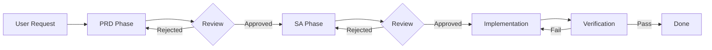

# SDD Skills Pack

A collection of AI agent skills for **Spec-Driven Development (SDD)** — a structured workflow that enforces explicit documentation before coding.

## Overview

This skill pack provides three interconnected skills that guide AI coding assistants through a rigorous development process:

| Skill | Description | Key Artifacts |
|-------|-------------|---------------|
| **[prd](./prd/SKILL.md)** | Product Requirement Documents — Define *what* to build and *why* | `PRD_spec.md` |
| **[sa](./sa/SKILL.md)** | System Analysis — Define *how* to build it (technical design) | `SA_spec.md` |
| **[sdd](./sdd/SKILL.md)** | Spec-Driven Development — The orchestrating workflow | Coordinates PRD → SA → Implementation |

## Core Principle

> **"No Spec, No Code"**

Every feature or fix must have complete documentation (PRD + SA) **before** any code is written.

## Installation

### Interactive Installer (Recommended)

Run the interactive installer directly from GitHub:

```bash
npx github:Tai-ch0802/skills-bundle
```

The installer will guide you through:
1. 🌐 **Language selection** — English or 繁體中文
2. 📦 **Skill selection** — Choose which skills to install (with auto-dependency resolution)
3. 📁 **Path selection** — Preset paths for popular AI agents or custom path

### Manual Installation

Copy the skill folders directly to your AI agent's skills directory:

```bash
# Example for Antigravity / Gemini CLI
cp -r prd sa sdd /your-project/.agent/skills/

# Example for Traditional Chinese version
cp -r i18n/zh-TW/* /your-project/.agent/skills/
```

## ⚠️ Required Configuration

**Before using these skills, you MUST customize the spec directory path.**

By default, the skills reference `/docs/specs/` as the documentation location. Update this path in:

1. **`sdd/SKILL.md`** — Lines referencing `/docs/specs/{type}/{ID-PREFIX}_{desc}/`
2. **`sdd/references/tasks.md`** — Task template paths

### Recommended Directory Structure

```
your-project/
├── docs/
│   └── specs/              ← Customize this path
│       ├── feature/
│       │   └── ISSUE-101_feature-name/
│       │       ├── PRD_spec.md
│       │       └── SA_spec.md
│       └── fix/
│           └── ISSUE-102_bug-name/
│               ├── PRD_spec.md
│               └── SA_spec.md
```

## Workflow



### Phase 1: PRD (Requirement)
- Draft `PRD_spec.md` with User Stories and Acceptance Criteria
- Get stakeholder approval

### Phase 2: SA (Design)
- Draft `SA_spec.md` with architecture and traceability matrix
- Get technical review approval

### Phase 3: Implementation
- Code based on approved specs
- Verify against Acceptance Criteria

## Skill Contents

### PRD Skill (`prd/`)
```
prd/
├── SKILL.md                           # Main skill instructions
└── references/
    ├── template_comprehensive.md      # Full PRD template
    └── template_simple.md             # Lightweight PRD template
```

### SA Skill (`sa/`)
```
sa/
├── SKILL.md                           # Main skill instructions
└── references/
    ├── diagram_guide.md               # Mermaid diagram examples
    └── system_design_doc.md           # Full SA template
```

### SDD Skill (`sdd/`)
```
sdd/
├── SKILL.md                           # Orchestration workflow
└── references/
    ├── requirements.md                # Quick PRD reference
    ├── design.md                      # Quick SA reference
    └── tasks.md                       # Implementation task template
```

## License

[MIT](./LICENSE)

## Internationalization (i18n)

This skill pack supports multiple languages. The default language is English (located at the project root), and additional languages are available under `i18n/`.

### Available Languages

| Language | Directory | Status |
|----------|-----------|--------|
| English (default) | `prd/`, `sa/`, `sdd/` | ✅ Complete |
| 繁體中文 (Traditional Chinese) | `i18n/zh-TW/` | ✅ Complete |

### Installing a Specific Language

```bash
# Install English (default)
cp -r prd sa sdd /your-project/.agent/skills/

# Install Traditional Chinese
cp -r i18n/zh-TW/* /your-project/.agent/skills/
```

### Directory Structure

```
skills-bundle/
├── prd/                 # English (default)
├── sa/
├── sdd/
└── i18n/
    └── zh-TW/           # Traditional Chinese
        ├── prd/
        ├── sa/
        └── sdd/
```

### Contributing Translations

To add a new language:

1. Create a new directory under `i18n/` (e.g., `i18n/ja/` for Japanese)
2. Copy the English skill structure and translate all files
3. Ensure all relative links within files are correct
4. Update the "Available Languages" table in this README

