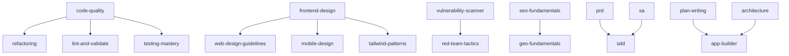

# Skills Bundle

A curated collection of AI agent skills for coding assistants.

## Overview

This repository bundles reusable skill packs that enhance AI coding assistants with structured methodologies, best practices, and automated validation scripts.

## Skill Sources

This project integrates skills from multiple sources:

| Source | Skills | Author |
|--------|--------|--------|
| **Original** | `prd`, `sa`, `sdd`, `refactoring` | [@Tai-ch0802](https://github.com/Tai-ch0802) |
| **[antigravity-kit](https://github.com/vudovn/antigravity-kit)** | 37 skills (see below) | [@vudovn](https://github.com/vudovn) |
| **Composite (new)** | `testing-mastery`, `code-quality` | Merged & curated by [@Tai-ch0802](https://github.com/Tai-ch0802) |

## Available Skills (35)

### SDD Pack (Original)

| Skill | Description |
|-------|-------------|
| **[prd](./prd/SKILL.md)** | Product Requirements Document guidelines |
| **[sa](./sa/SKILL.md)** | System Analysis methodology |
| **[sdd](./sdd/SKILL.md)** | Spec-Driven Development workflow (orchestrates prd → sa → implementation) |
| **[refactoring](./refactoring/SKILL.md)** | Code smell identification and refactoring techniques |

> **Core Principle**: "No Spec, No Code" — Every feature requires complete documentation before implementation.

### Antigravity Kit Skills (from [vudovn/antigravity-kit](https://github.com/vudovn/antigravity-kit))

<details>
<summary>Click to expand all 31 skills</summary>

| Skill | Description |
|-------|-------------|
| **[api-patterns](./api-patterns/SKILL.md)** | API design — REST vs GraphQL vs tRPC, versioning |
| **[app-builder](./app-builder/SKILL.md)** | Full-stack app building orchestrator |
| **[architecture](./architecture/SKILL.md)** | Architectural decision-making with ADR |
| **[bash-linux](./bash-linux/SKILL.md)** | Bash/Linux terminal patterns |
| **[behavioral-modes](./behavioral-modes/SKILL.md)** | AI operational modes (brainstorm, debug, review...) |
| **[brainstorming](./brainstorming/SKILL.md)** | Socratic questioning protocol |
| **[database-design](./database-design/SKILL.md)** | Schema, indexing, ORM selection |
| **[deployment-procedures](./deployment-procedures/SKILL.md)** | Production deployment workflows |
| **[documentation-templates](./documentation-templates/SKILL.md)** | README, API docs, code comments |
| **[frontend-design](./frontend-design/SKILL.md)** | Web UI design thinking |
| **[game-development](./game-development/SKILL.md)** | Game development orchestrator |
| **[geo-fundamentals](./geo-fundamentals/SKILL.md)** | Generative Engine Optimization |
| **[i18n-localization](./i18n-localization/SKILL.md)** | Internationalization & localization |
| **[intelligent-routing](./intelligent-routing/SKILL.md)** | Automatic agent selection |
| **[lint-and-validate](./lint-and-validate/SKILL.md)** | Linting & static analysis |
| **[mcp-builder](./mcp-builder/SKILL.md)** | MCP server building |
| **[mobile-design](./mobile-design/SKILL.md)** | Mobile-first design (iOS/Android) |
| **[nextjs-react-expert](./nextjs-react-expert/SKILL.md)** | React/Next.js performance optimization |
| **[nodejs-best-practices](./nodejs-best-practices/SKILL.md)** | Node.js development patterns |
| **[parallel-agents](./parallel-agents/SKILL.md)** | Multi-agent orchestration |
| **[performance-profiling](./performance-profiling/SKILL.md)** | Performance measurement & analysis |
| **[plan-writing](./plan-writing/SKILL.md)** | Structured task planning |
| **[powershell-windows](./powershell-windows/SKILL.md)** | PowerShell Windows patterns |
| **[python-patterns](./python-patterns/SKILL.md)** | Python development patterns |
| **[red-team-tactics](./red-team-tactics/SKILL.md)** | Red team tactics (MITRE ATT&CK) |
| **[rust-pro](./rust-pro/SKILL.md)** | Rust 1.75+ modern patterns |
| **[seo-fundamentals](./seo-fundamentals/SKILL.md)** | SEO fundamentals |
| **[server-management](./server-management/SKILL.md)** | Server management & scaling |
| **[systematic-debugging](./systematic-debugging/SKILL.md)** | 4-phase systematic debugging |
| **[tailwind-patterns](./tailwind-patterns/SKILL.md)** | Tailwind CSS v4 patterns |
| **[vulnerability-scanner](./vulnerability-scanner/SKILL.md)** | Vulnerability analysis (OWASP 2025) |
| **[web-design-guidelines](./web-design-guidelines/SKILL.md)** | UI code review for Web compliance |

</details>

### Composite Skills (Merged & Curated)

| Skill | Merged From | Description |
|-------|-------------|-------------|
| **[testing-mastery](./testing-mastery/SKILL.md)** | `tdd-workflow` + `testing-patterns` + `webapp-testing` | Unified testing — TDD, unit/integration, E2E/Playwright |
| **[code-quality](./code-quality/SKILL.md)** | `clean-code` + `code-review-checklist` | Coding standards & code review guidelines |

### Dependency Chains

Skills are linked by meaningful dependencies — installing one will auto-include its prerequisites:



## Installation

### Interactive Installer (Recommended)

```bash
npx github:Tai-ch0802/skills-bundle
```

The installer guides you through:
1. 🌐 **Language** — English or 繁體中文
2. 🎯 **Preset** — Full-Stack Web, Mobile, Security Expert, Architect, SDD, or Custom
3. 📦 **Skills** — Fine-tune selection (preset pre-checks relevant skills)
4. 📁 **Path** — Preset paths for popular AI agents or custom path

### Manual Installation

```bash
# Antigravity / Gemini CLI
cp -r prd sa sdd /your-project/.agent/skills/

# Traditional Chinese version
cp -r i18n/zh-TW/* /your-project/.agent/skills/
```

## Internationalization (i18n)

| Language | Directory | Status |
|----------|-----------|--------|
| English (default) | Root directories | ✅ Complete |
| 繁體中文 (Traditional Chinese) | `i18n/zh-TW/` | ✅ Complete |

### Contributing Translations

1. Create a new directory under `i18n/` (e.g., `i18n/ja/` for Japanese)
2. Mirror the English skill structure and translate all files
3. Update the language table above

## Project Structure

```
skills-bundle/
├── prd/                 # SDD: Product Requirements (original)
├── sa/                  # SDD: System Analysis (original)
├── sdd/                 # SDD: Orchestration (original)
├── refactoring/         # Refactoring skill (original)
├── testing-mastery/     # Composite: unified testing
├── code-quality/        # Composite: standards + review
├── api-patterns/        # ┐
├── architecture/        # │
├── frontend-design/     # │ Antigravity Kit skills
├── mobile-design/       # │ (from vudovn/antigravity-kit)
├── ...                  # │
├── vulnerability-scanner/ # ┘
├── i18n/
│   └── zh-TW/           # Traditional Chinese translations
├── bin/
│   └── install.mjs      # Interactive CLI installer
└── package.json
```

## License

[MIT](./LICENSE)

## Credits

- **SDD Pack & Refactoring** — Original work by [@Tai-ch0802](https://github.com/Tai-ch0802)
- **Antigravity Kit Skills** — From [vudovn/antigravity-kit](https://github.com/vudovn/antigravity-kit) by [@vudovn](https://github.com/vudovn)
- **Composite Skills & Translations** — Curated and translated by [@Tai-ch0802](https://github.com/Tai-ch0802)
