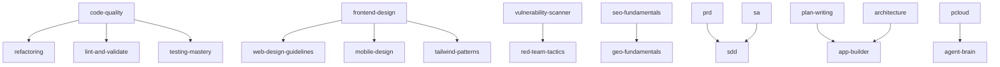

# Skills Bundle

A curated collection of AI agent skills for coding assistants.

## Overview

This repository bundles reusable skill packs that enhance AI coding assistants with structured methodologies, best practices, and automated validation scripts.

## Skill Sources

This project integrates skills from multiple sources:

| Source | Skills | Author |
|--------|--------|--------|
| **Original** | `prd`, `sa`, `sdd`, `refactoring` | [@Tai-ch0802](https://github.com/Tai-ch0802) |
| **[antigravity-kit](https://github.com/vudovn/antigravity-kit)** | 28 skills (see below) | [@vudovn](https://github.com/vudovn) |
| **[skills](https://github.com/anthropics/skills)** | 17 skills (see below) | [@anthropics](https://github.com/anthropics) |
| **[gemini-skills](https://github.com/google-gemini/gemini-skills)** | `gemini-api-dev`, `gemini-interactions-api`, `gemini-live-api-dev` | [@google-gemini](https://github.com/google-gemini) |
| **[humanizer](https://clawhub.ai/biostartechnology/humanizer)**, **[skill-vetter](https://clawhub.ai/spclaudehome/skill-vetter)** | `humanizer`, `skill-vetter` | ClawHub authors |
| **Composite (new)** | `testing-mastery`, `code-quality` | Merged & curated by [@Tai-ch0802](https://github.com/Tai-ch0802) |
| **Cloud & Memory** | `pcloud`, `agent-brain` | [@Tai-ch0802](https://github.com/Tai-ch0802) |

## Available Skills (62)

### SDD Pack (Original)

| Skill | Description |
|-------|-------------|
| **[prd](./prd/SKILL.md)** | Product Requirements Document guidelines |
| **[sa](./sa/SKILL.md)** | System Analysis methodology |
| **[sdd](./sdd/SKILL.md)** | Spec-Driven Development workflow (orchestrates prd → sa → implementation) |
| **[refactoring](./refactoring/SKILL.md)** | Code smell identification and refactoring techniques |

> **Core Principle**: "No Spec, No Code" — Every feature requires complete documentation before implementation.

### Antigravity Kit Skills (from [vudovn/antigravity-kit](https://github.com/vudovn/antigravity-kit))

<details>
<summary>Click to expand all 28 skills</summary>

| Skill | Description |
|-------|-------------|
| **[api-patterns](./api-patterns/SKILL.md)** | API design — REST vs GraphQL vs tRPC, versioning |
| **[app-builder](./app-builder/SKILL.md)** | Full-stack app building orchestrator |
| **[architecture](./architecture/SKILL.md)** | Architectural decision-making with ADR |
| **[bash-linux](./bash-linux/SKILL.md)** | Bash/Linux terminal patterns |
| **[behavioral-modes](./behavioral-modes/SKILL.md)** | AI operational modes (brainstorm, debug, review...) |
| **[brainstorming](./brainstorming/SKILL.md)** | Socratic questioning protocol |
| **[database-design](./database-design/SKILL.md)** | Schema, indexing, ORM selection |
| **[deployment-procedures](./deployment-procedures/SKILL.md)** | Production deployment workflows |
| **[documentation-templates](./documentation-templates/SKILL.md)** | README, API docs, code comments |
| **[game-development](./game-development/SKILL.md)** | Game development orchestrator |
| **[geo-fundamentals](./geo-fundamentals/SKILL.md)** | Generative Engine Optimization |
| **[i18n-localization](./i18n-localization/SKILL.md)** | Internationalization & localization |
| **[intelligent-routing](./intelligent-routing/SKILL.md)** | Automatic agent selection |
| **[lint-and-validate](./lint-and-validate/SKILL.md)** | Linting & static analysis |
| **[mobile-design](./mobile-design/SKILL.md)** | Mobile-first design (iOS/Android) |
| **[nextjs-react-expert](./nextjs-react-expert/SKILL.md)** | React/Next.js performance optimization |
| **[nodejs-best-practices](./nodejs-best-practices/SKILL.md)** | Node.js development patterns |
| **[parallel-agents](./parallel-agents/SKILL.md)** | Multi-agent orchestration |
| **[performance-profiling](./performance-profiling/SKILL.md)** | Performance measurement & analysis |
| **[plan-writing](./plan-writing/SKILL.md)** | Structured task planning |
| **[powershell-windows](./powershell-windows/SKILL.md)** | PowerShell Windows patterns |
| **[python-patterns](./python-patterns/SKILL.md)** | Python development patterns |
| **[red-team-tactics](./red-team-tactics/SKILL.md)** | Red team tactics (MITRE ATT&CK) |
| **[rust-pro](./rust-pro/SKILL.md)** | Rust 1.75+ modern patterns |
| **[seo-fundamentals](./seo-fundamentals/SKILL.md)** | SEO fundamentals |
| **[server-management](./server-management/SKILL.md)** | Server management & scaling |
| **[systematic-debugging](./systematic-debugging/SKILL.md)** | 4-phase systematic debugging |
| **[vulnerability-scanner](./vulnerability-scanner/SKILL.md)** | Vulnerability analysis (OWASP 2025) |
| **[web-design-guidelines](./web-design-guidelines/SKILL.md)** | UI code review for Web compliance |

</details>

### Anthropic Official Skills (from [anthropics/skills](https://github.com/anthropics/skills))

<details>
<summary>Click to expand all 17 skills</summary>

| Skill | Description | License |
|-------|-------------|---------|
| **[algorithmic-art](./algorithmic-art/SKILL.md)** | Algorithmic art with p5.js — seeded randomness, flow fields | Apache 2.0 |
| **[brand-guidelines](./brand-guidelines/SKILL.md)** | Apply Anthropic brand colors and typography to artifacts | Apache 2.0 |
| **[canvas-design](./canvas-design/SKILL.md)** | Visual art creation in .png/.pdf — posters, designs | Apache 2.0 |
| **[claude-api](./claude-api/SKILL.md)** | Build apps with Claude API / Anthropic SDK / Agent SDK | Apache 2.0 |
| **[doc-coauthoring](./doc-coauthoring/SKILL.md)** | Structured co-authoring workflow for docs and specs | Apache 2.0 |
| **docx** ⚡ | Create, read, edit Word documents (.docx) | Anthropic proprietary |
| **[frontend-design](./frontend-design/SKILL.md)** | Production-grade frontend interfaces — creative, polished UI | Apache 2.0 |
| **[internal-comms](./internal-comms/SKILL.md)** | Internal communications — status reports, newsletters | Apache 2.0 |
| **[mcp-builder](./mcp-builder/SKILL.md)** | MCP server building — FastMCP (Python) and MCP SDK (Node/TS) | Apache 2.0 |
| **pdf** ⚡ | PDF manipulation — read, merge, split, fill forms, OCR | Anthropic proprietary |
| **pptx** ⚡ | PowerPoint manipulation — create, read, edit presentations | Anthropic proprietary |
| **[skill-creator](./skill-creator/SKILL.md)** | Create, improve, and evaluate AI skills with benchmarking | Apache 2.0 |
| **[slack-gif-creator](./slack-gif-creator/SKILL.md)** | Create animated GIFs optimized for Slack | Apache 2.0 |
| **[theme-factory](./theme-factory/SKILL.md)** | Apply visual themes to slides, docs, reports (10 presets) | Apache 2.0 |
| **[web-artifacts-builder](./web-artifacts-builder/SKILL.md)** | Multi-component HTML artifacts with React, Tailwind, shadcn/ui | Apache 2.0 |
| **[webapp-testing](./webapp-testing/SKILL.md)** | Web app testing toolkit with Playwright | Apache 2.0 |
| **xlsx** ⚡ | Spreadsheet manipulation — read, write, format .xlsx/.csv | Anthropic proprietary |

> ⚡ **Remote skills**: `docx`, `pdf`, `pptx`, `xlsx` are downloaded at install time from the official [anthropics/skills](https://github.com/anthropics/skills) repo due to their proprietary license. They are not stored in this repository.

</details>

### Gemini API Skills (from [google-gemini/gemini-skills](https://github.com/google-gemini/gemini-skills))

| Skill | Description |
|-------|-------------|
| **[gemini-api-dev](./gemini-api-dev/SKILL.md)** | Gemini API development — SDK usage, multimodal, function calling, structured output |
| **[gemini-interactions-api](./gemini-interactions-api/SKILL.md)** | Gemini Interactions API — agentic applications, server-side state, tool orchestration, deep research |
| **[gemini-live-api-dev](./gemini-live-api-dev/SKILL.md)** | Gemini Live API development — real-time audio/video streaming, WebSockets, native audio |

### ClawHub Skills (from [biostartechnology/humanizer](https://clawhub.ai/biostartechnology/humanizer))

| Skill | Description |
|-------|-------------|
| **[humanizer](./humanizer/SKILL.md)** | Remove AI writing patterns — inflated symbolism, AI vocabulary, em dash overuse, vague attributions |
| **[skill-vetter](./skill-vetter/SKILL.md)** | Security-first skill vetting — red flags, permission scope, suspicious patterns |

### Composite Skills (Merged & Curated)

| Skill | Merged From | Description |
|-------|-------------|-------------|
| **[testing-mastery](./testing-mastery/SKILL.md)** | `tdd-workflow` + `testing-patterns` + `webapp-testing` | Unified testing — TDD, unit/integration, E2E/Playwright |
| **[code-quality](./code-quality/SKILL.md)** | `clean-code` + `code-review-checklist` | Coding standards & code review guidelines |

### Cloud & Memory Skills

| Skill | Description |
|-------|-------------|
| **[pcloud](./pcloud/SKILL.md)** | pCloud cloud storage API — file management, sharing, streaming, OAuth 2.0, SDKs |
| **[agent-brain](./agent-brain/SKILL.md)** | Persistent cross-session memory — digital twin brain with pCloud sync |

> **Note**: `agent-brain` depends on `pcloud` — installing it will auto-include the pCloud skill.

### Dependency Chains

Skills are linked by meaningful dependencies — installing one will auto-include its prerequisites:


```mermaid
graph TD
    CQ[code-quality] --> REF[refactoring]
    CQ --> LV[lint-and-validate]
    CQ --> TM[testing-mastery]
    FD[frontend-design] --> WDG[web-design-guidelines]
    FD --> MD[mobile-design]
    FD --> TP[tailwind-patterns]
    VS[vulnerability-scanner] --> RT[red-team-tactics]
    SEO[seo-fundamentals] --> GEO[geo-fundamentals]
    PRD[prd] --> SDD[sdd]
    SA[sa] --> SDD
    PW[plan-writing] --> AB[app-builder]
    ARCH[architecture] --> AB
    PC[pcloud] --> BRAIN[agent-brain]
```

## Installation

### Interactive Installer (Recommended)

```bash
npx github:Tai-ch0802/skills-bundle
```

The installer guides you through:
1. 🌐 **Language** — English or 繁體中文
2. 🎯 **Preset** — Full-Stack Web, Mobile, Security Expert, Architect, SDD, or Custom
3. 📦 **Skills** — Fine-tune selection (preset pre-checks relevant skills)
4. 📂 **Scope** — Project directory or global (`~/.gemini/antigravity/skills/`)
5. 📁 **Path** — Preset paths for popular AI agents or custom path

> **Note**: Remote skills (docx, pdf, pptx, xlsx) require internet access and are downloaded from GitHub at install time.

### Manual Installation

```bash
# Antigravity / Gemini CLI
cp -r prd sa sdd /your-project/.agent/skills/

# Traditional Chinese version
cp -r i18n/zh-TW/* /your-project/.agent/skills/
```

## Internationalization (i18n)

| Language | Directory | Status |
|----------|-----------|--------|
| English (default) | Root directories | ✅ Complete |
| 繁體中文 (Traditional Chinese) | `i18n/zh-TW/` | ✅ Complete |

### Contributing Translations

1. Create a new directory under `i18n/` (e.g., `i18n/ja/` for Japanese)
2. Mirror the English skill structure and translate all files
3. Update the language table above

## Project Structure

```
skills-bundle/
├── prd/                   # SDD: Product Requirements (original)
├── sa/                    # SDD: System Analysis (original)
├── sdd/                   # SDD: Orchestration (original)
├── refactoring/           # Refactoring skill (original)
├── testing-mastery/       # Composite: unified testing
├── code-quality/          # Composite: standards + review
├── pcloud/                # pCloud cloud storage API skill
├── agent-brain/           # Persistent cross-session memory
├── gemini-api-dev/        # ┐ Gemini API skills
├── gemini-interactions-api/ # │ (from google-gemini)
├── gemini-live-api-dev/   # ┘
├── algorithmic-art/       # ┐
├── brand-guidelines/      # │
├── canvas-design/         # │ Anthropic Official skills
├── claude-api/            # │ (from anthropics/skills)
├── frontend-design/       # │
├── mcp-builder/           # │
├── webapp-testing/        # │
├── ...                    # ┘
├── api-patterns/          # ┐
├── architecture/          # │ Antigravity Kit skills
├── mobile-design/         # │ (from vudovn/antigravity-kit)
├── ...                    # ┘
├── i18n/
│   └── zh-TW/             # Traditional Chinese translations
├── bin/
│   └── install.mjs        # Interactive CLI installer
├── .github/workflows/     # Upstream sync GitHub Actions
└── package.json
```

## License

[MIT](./LICENSE)

> **Note**: Skills from [anthropics/skills](https://github.com/anthropics/skills) carry their own licenses:
> - Most Anthropic skills: Apache 2.0
> - Document skills (`docx`, `pdf`, `pptx`, `xlsx`): Anthropic proprietary (source-available, not redistributed — downloaded at install time)

## Credits

- **SDD Pack & Refactoring** — Original work by [@Tai-ch0802](https://github.com/Tai-ch0802)
- **Antigravity Kit Skills** — From [vudovn/antigravity-kit](https://github.com/vudovn/antigravity-kit) by [@vudovn](https://github.com/vudovn)
- **Anthropic Official Skills** — From [anthropics/skills](https://github.com/anthropics/skills) by [@anthropics](https://github.com/anthropics)
- **Gemini API Skills** — From [google-gemini/gemini-skills](https://github.com/google-gemini/gemini-skills) by [@google-gemini](https://github.com/google-gemini)
- **Humanizer Skill** — From [biostartechnology/humanizer](https://clawhub.ai/biostartechnology/humanizer) on ClawHub
- **Skill Vetter** — From [spclaudehome/skill-vetter](https://clawhub.ai/spclaudehome/skill-vetter) on ClawHub
- **Cloud & Memory Skills** — pCloud API integration and agent-brain by [@Tai-ch0802](https://github.com/Tai-ch0802)
- **Composite Skills & Translations** — Curated and translated by [@Tai-ch0802](https://github.com/Tai-ch0802)
