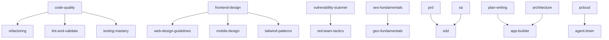

# Skills Bundle

A curated collection of AI agent skills for coding assistants.

## Overview

This repository bundles reusable skill packs that enhance AI coding assistants with structured methodologies, best practices, and automated validation scripts.

## Skill Sources

This project integrates skills from multiple sources:

| Source | Skills | Author |
|--------|--------|--------|
| **Original** | `prd`, `sa`, `sdd`, `refactoring` | [@Tai-ch0802](https://github.com/Tai-ch0802) |
| **[antigravity-kit](https://github.com/vudovn/antigravity-kit)** | 28 skills (see below) | [@vudovn](https://github.com/vudovn) |
| **[skills](https://github.com/anthropics/skills)** | 17 skills (see below) | [@anthropics](https://github.com/anthropics) |
| **[gemini-skills](https://github.com/google-gemini/gemini-skills)** | `gemini-api-dev`, `gemini-interactions-api`, `gemini-live-api-dev`, `vertex-ai-api-dev` | [@google-gemini](https://github.com/google-gemini) |
| **[humanizer](https://clawhub.ai/biostartechnology/humanizer)**, **[skill-vetter](https://clawhub.ai/spclaudehome/skill-vetter)** | `humanizer`, `skill-vetter` | ClawHub authors |
| **Composite (new)** | `testing-mastery`, `code-quality` | Merged & curated by [@Tai-ch0802](https://github.com/Tai-ch0802) |
| **Cloud & Memory** | `pcloud`, `agent-brain` | [@Tai-ch0802](https://github.com/Tai-ch0802) |

## Available Skills (63)

### SDD Pack (Original)

| Skill | Description |
|-------|-------------|
| **[prd](./prd/SKILL.md)** | Product Requirements Document guidelines |
| **[sa](./sa/SKILL.md)** | System Analysis methodology |
| **[sdd](./sdd/SKILL.md)** | Spec-Driven Development workflow (orchestrates prd → sa → implementation) |
| **[refactoring](./refactoring/SKILL.md)** | Code smell identification and refactoring techniques |

> **Core Principle**: "No Spec, No Code" — Every feature requires complete documentation before implementation.

### Antigravity Kit Skills ⚡ (from [vudovn/antigravity-kit](https://github.com/vudovn/antigravity-kit))

<details>
<summary>Click to expand all 28 skills (remote-downloaded at install time)</summary>

| Skill | Description |
|-------|-------------|
| **api-patterns** | API design — REST vs GraphQL vs tRPC, versioning |
| **app-builder** | Full-stack app building orchestrator |
| **architecture** | Architectural decision-making with ADR |
| **bash-linux** | Bash/Linux terminal patterns |
| **behavioral-modes** | AI operational modes (brainstorm, debug, review...) |
| **brainstorming** | Socratic questioning protocol |
| **database-design** | Schema, indexing, ORM selection |
| **deployment-procedures** | Production deployment workflows |
| **documentation-templates** | README, API docs, code comments |
| **game-development** | Game development orchestrator |
| **geo-fundamentals** | Generative Engine Optimization |
| **i18n-localization** | Internationalization & localization |
| **intelligent-routing** | Automatic agent selection |
| **lint-and-validate** | Linting & static analysis |
| **mobile-design** | Mobile-first design (iOS/Android) |
| **nextjs-react-expert** | React/Next.js performance optimization |
| **nodejs-best-practices** | Node.js development patterns |
| **parallel-agents** | Multi-agent orchestration |
| **performance-profiling** | Performance measurement & analysis |
| **plan-writing** | Structured task planning |
| **powershell-windows** | PowerShell Windows patterns |
| **python-patterns** | Python development patterns |
| **red-team-tactics** | Red team tactics (MITRE ATT&CK) |
| **rust-pro** | Rust 1.75+ modern patterns |
| **seo-fundamentals** | SEO fundamentals |
| **server-management** | Server management & scaling |
| **systematic-debugging** | 4-phase systematic debugging |
| **vulnerability-scanner** | Vulnerability analysis (OWASP 2025) |
| **web-design-guidelines** | UI code review for Web compliance |

</details>

### Anthropic Official Skills ⚡ (from [anthropics/skills](https://github.com/anthropics/skills))

<details>
<summary>Click to expand all 17 skills (remote-downloaded at install time)</summary>

| Skill | Description | License |
|-------|-------------|---------|
| **algorithmic-art** | Algorithmic art with p5.js — seeded randomness, flow fields | Apache 2.0 |
| **brand-guidelines** | Apply Anthropic brand colors and typography to artifacts | Apache 2.0 |
| **canvas-design** | Visual art creation in .png/.pdf — posters, designs | Apache 2.0 |
| **claude-api** | Build apps with Claude API / Anthropic SDK / Agent SDK | Apache 2.0 |
| **doc-coauthoring** | Structured co-authoring workflow for docs and specs | Apache 2.0 |
| **docx** | Create, read, edit Word documents (.docx) | Anthropic proprietary |
| **frontend-design** | Production-grade frontend interfaces — creative, polished UI | Apache 2.0 |
| **internal-comms** | Internal communications — status reports, newsletters | Apache 2.0 |
| **mcp-builder** | MCP server building — FastMCP (Python) and MCP SDK (Node/TS) | Apache 2.0 |
| **pdf** | PDF manipulation — read, merge, split, fill forms, OCR | Anthropic proprietary |
| **pptx** | PowerPoint manipulation — create, read, edit presentations | Anthropic proprietary |
| **skill-creator** | Create, improve, and evaluate AI skills with benchmarking | Apache 2.0 |
| **slack-gif-creator** | Create animated GIFs optimized for Slack | Apache 2.0 |
| **theme-factory** | Apply visual themes to slides, docs, reports (10 presets) | Apache 2.0 |
| **web-artifacts-builder** | Multi-component HTML artifacts with React, Tailwind, shadcn/ui | Apache 2.0 |
| **webapp-testing** | Web app testing toolkit with Playwright | Apache 2.0 |
| **xlsx** | Spreadsheet manipulation — read, write, format .xlsx/.csv | Anthropic proprietary |

</details>

### Gemini API Skills ⚡ (from [google-gemini/gemini-skills](https://github.com/google-gemini/gemini-skills))

| Skill | Description |
|-------|-------------|
| **gemini-api-dev** | Gemini API development — SDK usage, multimodal, function calling, structured output |
| **gemini-interactions-api** | Gemini Interactions API — agentic applications, server-side state, tool orchestration, deep research |
| **gemini-live-api-dev** | Gemini Live API development — real-time audio/video streaming, WebSockets, native audio |
| **vertex-ai-api-dev** | Gemini API in Vertex AI — SDK usage (Python, JS/TS, Go, Java, C#), Live API, tools, multimodal, caching, batch prediction |

### ClawHub Skills (from [biostartechnology/humanizer](https://clawhub.ai/biostartechnology/humanizer))

| Skill | Description |
|-------|-------------|
| **[humanizer](./humanizer/SKILL.md)** | Remove AI writing patterns — inflated symbolism, AI vocabulary, em dash overuse, vague attributions |
| **[skill-vetter](./skill-vetter/SKILL.md)** | Security-first skill vetting — red flags, permission scope, suspicious patterns |

### Composite Skills (Merged & Curated)

| Skill | Merged From | Description |
|-------|-------------|-------------|
| **[testing-mastery](./testing-mastery/SKILL.md)** | `tdd-workflow` + `testing-patterns` + `webapp-testing` | Unified testing — TDD, unit/integration, E2E/Playwright |
| **[code-quality](./code-quality/SKILL.md)** | `clean-code` + `code-review-checklist` | Coding standards & code review guidelines |

### Cloud & Memory Skills

| Skill | Description |
|-------|-------------|
| **[pcloud](./pcloud/SKILL.md)** | pCloud cloud storage API — file management, sharing, streaming, OAuth 2.0, SDKs |
| **[agent-brain](./agent-brain/SKILL.md)** | Persistent cross-session memory — digital twin brain with pCloud sync |

> **Note**: `agent-brain` depends on `pcloud` — installing it will auto-include the pCloud skill.

### Dependency Chains

Skills are linked by meaningful dependencies — installing one will auto-include its prerequisites:


```mermaid
graph TD
    CQ[code-quality] --> REF[refactoring]
    CQ --> LV[lint-and-validate]
    CQ --> TM[testing-mastery]
    FD[frontend-design] --> WDG[web-design-guidelines]
    FD --> MD[mobile-design]
    FD --> TP[tailwind-patterns]
    VS[vulnerability-scanner] --> RT[red-team-tactics]
    SEO[seo-fundamentals] --> GEO[geo-fundamentals]
    PRD[prd] --> SDD[sdd]
    SA[sa] --> SDD
    PW[plan-writing] --> AB[app-builder]
    ARCH[architecture] --> AB
    PC[pcloud] --> BRAIN[agent-brain]
```

> ⚡ **Remote Download Architecture**: Skills marked with ⚡ are **not stored locally** in this repo. They are downloaded from their upstream GitHub repos at install time using the interactive installer. Only original skills, composite skills, ClawHub skills, and zh-TW translations are stored in this repo.

## Role-Based Presets

The installer includes 8 curated presets. Selecting a preset pre-checks the listed skills (you can still add or remove before installing). Dependencies are auto-resolved.

### 🌐 Full-Stack Web Development (14 skills)

| Skill | Description |
|-------|-------------|
| frontend-design | Production-grade frontend interfaces — creative, polished UI |
| tailwind-patterns | Tailwind CSS v4 — CSS-first config, container queries, design tokens |
| nextjs-react-expert | React/Next.js performance optimization |
| api-patterns | API design — REST vs GraphQL vs tRPC, versioning |
| database-design | Schema design, indexing, ORM selection |
| nodejs-best-practices | Node.js development patterns |
| testing-mastery | Unified testing — TDD, unit/integration, E2E/Playwright |
| deployment-procedures | Production deployment workflows & rollback |
| seo-fundamentals | SEO fundamentals — E-E-A-T, Core Web Vitals |
| code-quality | Coding standards & code review guidelines |
| lint-and-validate | Linting & static analysis |
| web-design-guidelines | UI code review for Web compliance |
| documentation-templates | README, API docs, code comments |
| systematic-debugging | 4-phase systematic debugging with root cause analysis |

### 📱 Mobile Full-Stack (10 skills)

| Skill | Description |
|-------|-------------|
| mobile-design | Mobile-first design for iOS/Android |
| api-patterns | API design principles |
| database-design | Schema design, indexing, ORM selection |
| testing-mastery | Unified testing — TDD, unit/integration, E2E |
| deployment-procedures | Production deployment workflows |
| code-quality | Coding standards & code review |
| lint-and-validate | Linting & static analysis |
| performance-profiling | Performance measurement & analysis |
| systematic-debugging | 4-phase systematic debugging |
| documentation-templates | README, API docs, code comments |

### 🛡️ Security Expert (6 skills)

| Skill | Description |
|-------|-------------|
| vulnerability-scanner | Vulnerability analysis — OWASP 2025, supply chain security |
| red-team-tactics | Red team tactics based on MITRE ATT&CK |
| code-quality | Coding standards & code review |
| systematic-debugging | 4-phase systematic debugging |
| server-management | Server management & scaling |
| bash-linux | Bash/Linux terminal patterns |

### 🏗️ Architect (9 skills)

| Skill | Description |
|-------|-------------|
| architecture | Architectural decision-making with ADR |
| api-patterns | API design principles |
| database-design | Schema design, indexing, ORM selection |
| plan-writing | Structured task planning |
| code-quality | Coding standards & code review |
| performance-profiling | Performance measurement & analysis |
| deployment-procedures | Production deployment workflows |
| documentation-templates | README, API docs, code comments |
| systematic-debugging | 4-phase systematic debugging |

### 🤖 AI & API Builder (8 skills)

| Skill | Description |
|-------|-------------|
| claude-api | Build apps with Claude API / Anthropic SDK / Agent SDK |
| gemini-api-dev | Gemini API development — SDK, multimodal, function calling |
| mcp-builder | MCP server building — FastMCP (Python) and MCP SDK (Node/TS) |
| app-builder | Full-stack app building orchestrator |
| api-patterns | API design principles |
| plan-writing | Structured task planning |
| testing-mastery | Unified testing — TDD, unit/integration, E2E |
| code-quality | Coding standards & code review |

### ✍️ Content & Docs Creator (12 skills)

| Skill | Description |
|-------|-------------|
| docx | Create, read, edit Word documents (.docx) |
| pdf | PDF manipulation — read, merge, split, fill forms, OCR |
| pptx | PowerPoint manipulation — create, read, edit presentations |
| xlsx | Spreadsheet manipulation — read, write, format .xlsx/.csv |
| frontend-design | Production-grade frontend interfaces |
| canvas-design | Visual art creation in .png/.pdf — posters, designs |
| brand-guidelines | Apply Anthropic brand colors and typography |
| theme-factory | Apply visual themes to slides, docs, reports (10 presets) |
| doc-coauthoring | Structured co-authoring for docs and specs |
| humanizer | Remove AI writing patterns |
| internal-comms | Internal communications — status reports, newsletters |
| skill-creator | Create, improve, and evaluate AI skills |

### ⚙️ DevOps & Infrastructure (7 skills)

| Skill | Description |
|-------|-------------|
| bash-linux | Bash/Linux terminal patterns |
| server-management | Server management & scaling |
| deployment-procedures | Production deployment workflows |
| performance-profiling | Performance measurement & analysis |
| systematic-debugging | 4-phase systematic debugging |
| lint-and-validate | Linting & static analysis |
| powershell-windows | PowerShell Windows patterns |

### 📝 Spec-Driven Development (4 skills)

| Skill | Description |
|-------|-------------|
| sdd | Spec-Driven Development workflow (auto-includes prd, sa) |
| refactoring | Code smell identification and refactoring techniques |
| plan-writing | Structured task planning |
| documentation-templates | README, API docs, code comments |

> **Note**: Dependencies are auto-resolved. For example, selecting `sdd` will auto-include `prd` and `sa`; selecting `refactoring` will auto-include `code-quality`.

## Installation

### Interactive Installer (Recommended)

```bash
npx github:Tai-ch0802/skills-bundle
```

The installer guides you through:
1. 🌐 **Language** — English or 繁體中文
2. 🎯 **Preset** — Full-Stack Web, Mobile, Security, Architect, AI Builder, Content Creator, DevOps, SDD, or Custom
3. 📦 **Skills** — Fine-tune selection (preset pre-checks relevant skills)
4. 📂 **Scope** — Project directory or global (`~/.gemini/antigravity/skills/`)
5. 📁 **Path** — Preset paths for popular AI agents or custom path

> **Note**: Most skills (⚡) require internet access and are downloaded from GitHub at install time.

### Manual Installation

```bash
# Only locally-stored skills can be copied manually:
cp -r prd sa sdd refactoring /your-project/.agent/skills/

# Traditional Chinese version
cp -r i18n/zh-TW/* /your-project/.agent/skills/
```

> For remote skills, use the interactive installer — it handles downloading automatically.

## Internationalization (i18n)

| Language | Directory | Status |
|----------|-----------|--------|
| English (default) | Root directories | ✅ Complete |
| 繁體中文 (Traditional Chinese) | `i18n/zh-TW/` | ✅ Complete |

### Contributing Translations

1. Create a new directory under `i18n/` (e.g., `i18n/ja/` for Japanese)
2. Mirror the English skill structure and translate all files
3. Update the language table above

## Project Structure

```
skills-bundle/
├── prd/                   # SDD: Product Requirements (original)
├── sa/                    # SDD: System Analysis (original)
├── sdd/                   # SDD: Orchestration (original)
├── refactoring/           # Refactoring skill (original)
├── testing-mastery/       # Composite: unified testing
├── code-quality/          # Composite: standards + review
├── humanizer/             # ClawHub: Remove AI writing patterns
├── skill-vetter/          # ClawHub: Security-first skill vetting
├── pcloud/                # pCloud cloud storage API skill
├── agent-brain/           # Persistent cross-session memory
├── i18n/
│   └── zh-TW/             # Traditional Chinese translations (all 63 skills)
├── bin/
│   └── install.mjs        # Interactive installer (downloads ⚡ skills at runtime)
├── .github/workflows/     # Upstream sync GitHub Actions (metadata & i18n only)
└── package.json
```

> **Note**: 49 skills from upstream repos (Antigravity Kit, Anthropic, Gemini) are **not stored locally**. They are downloaded from GitHub at install time via the `REMOTE_SKILLS` config in `bin/install.mjs`.

## License

[MIT](./LICENSE)

> **Note**: Skills from [anthropics/skills](https://github.com/anthropics/skills) carry their own licenses:
> - Most Anthropic skills: Apache 2.0
> - Document skills (`docx`, `pdf`, `pptx`, `xlsx`): Anthropic proprietary (source-available, not redistributed — downloaded at install time)

## Credits

- **SDD Pack & Refactoring** — Original work by [@Tai-ch0802](https://github.com/Tai-ch0802)
- **Antigravity Kit Skills** — From [vudovn/antigravity-kit](https://github.com/vudovn/antigravity-kit) by [@vudovn](https://github.com/vudovn)
- **Anthropic Official Skills** — From [anthropics/skills](https://github.com/anthropics/skills) by [@anthropics](https://github.com/anthropics)
- **Gemini API Skills** — From [google-gemini/gemini-skills](https://github.com/google-gemini/gemini-skills) by [@google-gemini](https://github.com/google-gemini)
- **Humanizer Skill** — From [biostartechnology/humanizer](https://clawhub.ai/biostartechnology/humanizer) on ClawHub
- **Skill Vetter** — From [spclaudehome/skill-vetter](https://clawhub.ai/spclaudehome/skill-vetter) on ClawHub
- **Cloud & Memory Skills** — pCloud API integration and agent-brain by [@Tai-ch0802](https://github.com/Tai-ch0802)
- **Composite Skills & Translations** — Curated and translated by [@Tai-ch0802](https://github.com/Tai-ch0802)
