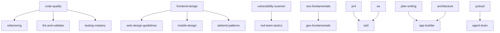

# Skills Bundle — 技能包

AI 編碼助理的精選技能合集。

## 概覽

本倉庫彙集了多種可重複使用的技能包，為 AI 編碼助理提供結構化方法論、最佳實踐和自動化驗證腳本。

## 技能來源

本專案整合了多個來源的技能：

| 來源 | 技能 | 作者 |
|------|------|------|
| **原創** | `prd`, `sa`, `sdd`, `refactoring` | [@Tai-ch0802](https://github.com/Tai-ch0802) |
| **[antigravity-kit](https://github.com/vudovn/antigravity-kit)** | 28 個技能（見下方） | [@vudovn](https://github.com/vudovn) |
| **[skills](https://github.com/anthropics/skills)** | 17 個技能（見下方） | [@anthropics](https://github.com/anthropics) |
| **[gemini-skills](https://github.com/google-gemini/gemini-skills)** | `gemini-api-dev`, `gemini-interactions-api`, `gemini-live-api-dev` | [@google-gemini](https://github.com/google-gemini) |
| **[humanizer](https://clawhub.ai/biostartechnology/humanizer)**, **[skill-vetter](https://clawhub.ai/spclaudehome/skill-vetter)** | `humanizer`, `skill-vetter` | ClawHub 作者 |
| **合成（新）** | `testing-mastery`, `code-quality` | 由 [@Tai-ch0802](https://github.com/Tai-ch0802) 合併策劃 |
| **雲端與記憶** | `pcloud`, `agent-brain` | [@Tai-ch0802](https://github.com/Tai-ch0802) |

## 可用技能（62 個）

### SDD 技能包（原創）

| 技能 | 說明 |
|------|------|
| **[prd](../../prd/SKILL.md)** | 產品需求文件指南 |
| **[sa](../../sa/SKILL.md)** | 系統分析方法論 |
| **[sdd](../../sdd/SKILL.md)** | 規格驅動開發工作流程（協調 prd → sa → 實作） |
| **[refactoring](../../refactoring/SKILL.md)** | 程式碼異味識別與重構技術 |

> **核心原則**：「沒有規格，不寫程式」— 每個功能在實作前都需要完整的文件。

### Antigravity Kit 技能 ⚡（來自 [vudovn/antigravity-kit](https://github.com/vudovn/antigravity-kit)）

<details>
<summary>點擊展開全部 28 個技能（安裝時遠端下載）</summary>

| 技能 | 說明 |
|------|------|
| **api-patterns** | API 設計 — REST vs GraphQL vs tRPC、版本控制 |
| **app-builder** | 全端應用程式建構協調器 |
| **architecture** | 架構決策框架與 ADR |
| **bash-linux** | Bash/Linux 終端模式 |
| **behavioral-modes** | AI 操作模式（腦力激盪、除錯、審查…） |
| **brainstorming** | 蘇格拉底式提問協議 |
| **database-design** | Schema、索引、ORM 選擇 |
| **deployment-procedures** | 生產環境部署流程 |
| **documentation-templates** | README、API 文件、程式碼註解 |
| **game-development** | 遊戲開發協調器 |
| **geo-fundamentals** | 生成式引擎最佳化 |
| **i18n-localization** | 國際化與本地化 |
| **intelligent-routing** | 自動代理選擇 |
| **lint-and-validate** | 程式碼檢查與靜態分析 |
| **mobile-design** | 行動優先設計（iOS/Android） |
| **nextjs-react-expert** | React/Next.js 效能最佳化 |
| **nodejs-best-practices** | Node.js 開發模式 |
| **parallel-agents** | 多代理協調 |
| **performance-profiling** | 效能量測與分析 |
| **plan-writing** | 結構化任務規劃 |
| **powershell-windows** | PowerShell Windows 模式 |
| **python-patterns** | Python 開發模式 |
| **red-team-tactics** | 紅隊戰術（MITRE ATT&CK） |
| **rust-pro** | Rust 1.75+ 現代模式 |
| **seo-fundamentals** | SEO 基礎 |
| **server-management** | 伺服器管理與擴展 |
| **systematic-debugging** | 四階段系統化除錯 |
| **vulnerability-scanner** | 弱點分析（OWASP 2025） |
| **web-design-guidelines** | UI 程式碼審查 |

</details>

### Anthropic 官方技能 ⚡（來自 [anthropics/skills](https://github.com/anthropics/skills)）

<details>
<summary>點擊展開全部 17 個技能（安裝時遠端下載）</summary>

| 技能 | 說明 | 授權 |
|------|------|------|
| **algorithmic-art** | 使用 p5.js 的演算法藝術 — 種子隨機性、流場 | Apache 2.0 |
| **brand-guidelines** | 套用 Anthropic 品牌色彩與排版至產出物 | Apache 2.0 |
| **canvas-design** | 視覺藝術創作（.png/.pdf）— 海報、設計 | Apache 2.0 |
| **claude-api** | 使用 Claude API / Anthropic SDK / Agent SDK 建構應用 | Apache 2.0 |
| **doc-coauthoring** | 結構化文件共同撰寫工作流程 | Apache 2.0 |
| **docx** | Word 文件操作 — 建立、讀取、編輯 .docx | Anthropic 專有 |
| **frontend-design** | 生產等級前端介面 — 創意且精緻的 UI | Apache 2.0 |
| **internal-comms** | 內部通訊 — 狀態報告、電子報 | Apache 2.0 |
| **mcp-builder** | MCP 伺服器建構 — FastMCP (Python) 與 MCP SDK (Node/TS) | Apache 2.0 |
| **pdf** | PDF 操作 — 讀取、合併、分割、填表、OCR | Anthropic 專有 |
| **pptx** | PowerPoint 操作 — 建立、讀取、編輯簡報 | Anthropic 專有 |
| **skill-creator** | AI 技能建立、改善與評估（含基準測試） | Apache 2.0 |
| **slack-gif-creator** | 建立針對 Slack 最佳化的動態 GIF | Apache 2.0 |
| **theme-factory** | 為投影片、文件、報告套用視覺主題（10 種預設） | Apache 2.0 |
| **web-artifacts-builder** | 多元件 HTML 產出物 — React、Tailwind、shadcn/ui | Apache 2.0 |
| **webapp-testing** | Web 應用測試工具包 — Playwright | Apache 2.0 |
| **xlsx** | 試算表操作 — 讀取、寫入、格式化 .xlsx/.csv | Anthropic 專有 |

</details>

### Gemini API 技能 ⚡（來自 [google-gemini/gemini-skills](https://github.com/google-gemini/gemini-skills)）

| 技能 | 說明 |
|------|------|
| **gemini-api-dev** | Gemini API 開發 — SDK 使用、多模態、函式呼叫、結構化輸出 |
| **gemini-interactions-api** | Gemini Interactions API — 代理應用程式、伺服器端狀態、工具協調、深度研究 |
| **gemini-live-api-dev** | Gemini Live API 開發 — 即時音訊/視訊串流、WebSockets、原生音訊 |

### ClawHub 技能（來自 [biostartechnology/humanizer](https://clawhub.ai/biostartechnology/humanizer)）

| 技能 | 說明 |
|------|------|
| **[humanizer](../../humanizer/SKILL.md)** | 移除 AI 寫作模式 — 膨脹象徵主義、AI 詞彙、破折號濫用、模糊歸因 |
| **[skill-vetter](../../skill-vetter/SKILL.md)** | 安全優先的技能審查 — 紅色旗標、權限範圍、可疑模式偵測 |

### 合成技能（合併與策劃）

| 技能 | 合併自 | 說明 |
|------|--------|------|
| **[testing-mastery](../../testing-mastery/SKILL.md)** | `tdd-workflow` + `testing-patterns` + `webapp-testing` | 統一測試 — TDD、單元/整合、E2E/Playwright |
| **[code-quality](../../code-quality/SKILL.md)** | `clean-code` + `code-review-checklist` | 編碼標準與程式碼審查指南 |

### 雲端與記憶技能

| 技能 | 說明 |
|------|------|
| **[pcloud](../../pcloud/SKILL.md)** | pCloud 雲端儲存 API — 檔案管理、分享、串流、OAuth 2.0、SDK |
| **[agent-brain](../../agent-brain/SKILL.md)** | 持久化跨 Session 記憶 — 數位孿生大腦，搭配 pCloud 同步 |

> **注意**：`agent-brain` 依賴 `pcloud` — 安裝時會自動包含 pCloud 技能。

### 依賴鏈

技能之間有明確的依賴關係 — 安裝某技能時會自動包含其前置需求：



> ⚡ **遠端下載架構**：標記 ⚡ 的技能**不會儲存在本倉庫**中。它們會在安裝時從上游 GitHub 倉庫下載。只有原創技能、合成技能、ClawHub 技能和繁體中文翻譯儲存在本倉庫中。

## 角色技能套組

安裝程式包含 8 個精選套組。選擇套組後會自動預勾選對應技能（安裝前仍可自行增減）。依賴關係會自動解析。

### 🌐 全端 Web 開發（14 個技能）

| 技能 | 說明 |
|------|------|
| frontend-design | 生產等級前端介面 — 創意且精緻的 UI |
| tailwind-patterns | Tailwind CSS v4 — CSS 優先配置、容器查詢、設計代幣 |
| nextjs-react-expert | React/Next.js 效能最佳化 |
| api-patterns | API 設計 — REST vs GraphQL vs tRPC、版本控制 |
| database-design | Schema 設計、索引、ORM 選擇 |
| nodejs-best-practices | Node.js 開發模式 |
| testing-mastery | 統一測試 — TDD、單元/整合、E2E/Playwright |
| deployment-procedures | 生產環境部署流程與回滾 |
| seo-fundamentals | SEO 基礎 — E-E-A-T、Core Web Vitals |
| code-quality | 編碼標準與程式碼審查指南 |
| lint-and-validate | 程式碼檢查與靜態分析 |
| web-design-guidelines | UI 程式碼審查，符合 Web 介面指南 |
| documentation-templates | README、API 文件、程式碼註解 |
| systematic-debugging | 四階段系統化除錯與根因分析 |

### 📱 行動端全端開發（10 個技能）

| 技能 | 說明 |
|------|------|
| mobile-design | 行動優先設計（iOS/Android） |
| api-patterns | API 設計原則 |
| database-design | Schema 設計、索引、ORM 選擇 |
| testing-mastery | 統一測試 — TDD、單元/整合、E2E |
| deployment-procedures | 生產環境部署流程 |
| code-quality | 編碼標準與程式碼審查 |
| lint-and-validate | 程式碼檢查與靜態分析 |
| performance-profiling | 效能量測與分析 |
| systematic-debugging | 四階段系統化除錯 |
| documentation-templates | README、API 文件、程式碼註解 |

### 🛡️ 安全專家（6 個技能）

| 技能 | 說明 |
|------|------|
| vulnerability-scanner | 弱點分析 — OWASP 2025、供應鏈安全 |
| red-team-tactics | 紅隊戰術（基於 MITRE ATT&CK） |
| code-quality | 編碼標準與程式碼審查 |
| systematic-debugging | 四階段系統化除錯 |
| server-management | 伺服器管理與擴展 |
| bash-linux | Bash/Linux 終端模式 |

### 🏗️ 架構師（9 個技能）

| 技能 | 說明 |
|------|------|
| architecture | 架構決策框架與 ADR |
| api-patterns | API 設計原則 |
| database-design | Schema 設計、索引、ORM 選擇 |
| plan-writing | 結構化任務規劃 |
| code-quality | 編碼標準與程式碼審查 |
| performance-profiling | 效能量測與分析 |
| deployment-procedures | 生產環境部署流程 |
| documentation-templates | README、API 文件、程式碼註解 |
| systematic-debugging | 四階段系統化除錯 |

### 🤖 AI 與 API 建構師（8 個技能）

| 技能 | 說明 |
|------|------|
| claude-api | 使用 Claude API / Anthropic SDK / Agent SDK 建構應用 |
| gemini-api-dev | Gemini API 開發 — SDK、多模態、函式呼叫 |
| mcp-builder | MCP 伺服器建構 — FastMCP (Python) 與 MCP SDK (Node/TS) |
| app-builder | 全端應用程式建構協調器 |
| api-patterns | API 設計原則 |
| plan-writing | 結構化任務規劃 |
| testing-mastery | 統一測試 — TDD、單元/整合、E2E |
| code-quality | 編碼標準與程式碼審查 |

### ✍️ 內容與文件創建（12 個技能）

| 技能 | 說明 |
|------|------|
| docx | Word 文件操作 — 建立、讀取、編輯 .docx |
| pdf | PDF 操作 — 讀取、合併、分割、填表、OCR |
| pptx | PowerPoint 操作 — 建立、讀取、編輯簡報 |
| xlsx | 試算表操作 — 讀取、寫入、格式化 .xlsx/.csv |
| frontend-design | 生產等級前端介面 |
| canvas-design | 視覺藝術創作（.png/.pdf）— 海報、設計 |
| brand-guidelines | 套用 Anthropic 品牌色彩與排版 |
| theme-factory | 為投影片、文件、報告套用視覺主題（10 種預設） |
| doc-coauthoring | 結構化文件共同撰寫 |
| humanizer | 移除 AI 寫作模式 |
| internal-comms | 內部通訊 — 狀態報告、電子報 |
| skill-creator | AI 技能建立、改善與評估 |

### ⚙️ DevOps 與基礎設施（7 個技能）

| 技能 | 說明 |
|------|------|
| bash-linux | Bash/Linux 終端模式 |
| server-management | 伺服器管理與擴展 |
| deployment-procedures | 生產環境部署流程 |
| performance-profiling | 效能量測與分析 |
| systematic-debugging | 四階段系統化除錯 |
| lint-and-validate | 程式碼檢查與靜態分析 |
| powershell-windows | PowerShell Windows 模式 |

### 📝 規格驅動開發（4 個技能）

| 技能 | 說明 |
|------|------|
| sdd | 規格驅動開發工作流程（自動包含 prd、sa） |
| refactoring | 程式碼異味識別與重構技術 |
| plan-writing | 結構化任務規劃 |
| documentation-templates | README、API 文件、程式碼註解 |

> **注意**：依賴關係會自動解析。例如，選擇 `sdd` 會自動包含 `prd` 和 `sa`；選擇 `refactoring` 會自動包含 `code-quality`。

## 安裝

### 互動式安裝程式（推薦）

```bash
npx github:Tai-ch0802/skills-bundle
```

安裝程式會引導您完成以下步驟：
1. 🌐 **語言** — English 或 繁體中文
2. 🎯 **套組** — 全端 Web、行動端、安全專家、架構師、AI 建構師、內容創建、DevOps、SDD 或自訂
3. 📦 **技能** — 微調選擇（套組會預先勾選相關技能）
4. 📂 **範圍** — 專案目錄或全域（`~/.gemini/antigravity/skills/`）
5. 📁 **路徑** — 常用 AI 代理的預設路徑或自訂路徑

> **注意**：大多數技能（⚡）需要網路連線，會在安裝時從 GitHub 下載。

### 手動安裝

```bash
# 只有本地儲存的技能可以手動複製：
cp -r prd sa sdd refactoring /your-project/.agent/skills/

# 繁體中文版本
cp -r i18n/zh-TW/* /your-project/.agent/skills/
```

> 遠端技能請使用互動式安裝程式 — 它會自動處理下載。

## 國際化（i18n）

| 語言 | 目錄 | 狀態 |
|------|------|------|
| English（預設） | 根目錄 | ✅ 完整 |
| 繁體中文 | `i18n/zh-TW/` | ✅ 完整 |

### 貢獻翻譯

1. 在 `i18n/` 下建立新目錄（例如 `i18n/ja/` 用於日文）
2. 鏡像英文技能結構並翻譯所有檔案
3. 更新上方的語言表

## 專案結構

```
skills-bundle/
├── prd/                   # SDD：產品需求（原創）
├── sa/                    # SDD：系統分析（原創）
├── sdd/                   # SDD：協調（原創）
├── refactoring/           # 重構技能（原創）
├── testing-mastery/       # 合成：統一測試
├── code-quality/          # 合成：標準 + 審查
├── humanizer/             # ClawHub：移除 AI 寫作模式
├── skill-vetter/          # ClawHub：安全優先技能審查
├── pcloud/                # pCloud 雲端儲存 API 技能
├── agent-brain/           # 持久化跨 Session 記憶
├── i18n/
│   └── zh-TW/             # 繁體中文翻譯（全部 62 個技能）
├── bin/
│   └── install.mjs        # 互動式安裝程式（安裝時下載 ⚡ 技能）
├── .github/workflows/     # 上游同步 GitHub Actions（僅元資料與 i18n）
└── package.json
```

> **注意**：來自上游倉庫（Antigravity Kit、Anthropic、Gemini）的 48 個技能**不會儲存在本地**。它們會在安裝時透過 `bin/install.mjs` 中的 `REMOTE_SKILLS` 設定從 GitHub 下載。

## 授權

[MIT](../../LICENSE)

> **注意**：來自 [anthropics/skills](https://github.com/anthropics/skills) 的技能有各自的授權：
> - 大多數 Anthropic 技能：Apache 2.0
> - 文件技能（`docx`、`pdf`、`pptx`、`xlsx`）：Anthropic 專有（源碼可見，不再分發 — 安裝時下載）

## 致謝

- **SDD 技能包與重構** — 由 [@Tai-ch0802](https://github.com/Tai-ch0802) 原創
- **Antigravity Kit 技能** — 來自 [vudovn/antigravity-kit](https://github.com/vudovn/antigravity-kit)，由 [@vudovn](https://github.com/vudovn) 開發
- **Anthropic 官方技能** — 來自 [anthropics/skills](https://github.com/anthropics/skills)，由 [@anthropics](https://github.com/anthropics) 開發
- **Gemini API 技能** — 來自 [google-gemini/gemini-skills](https://github.com/google-gemini/gemini-skills)，由 [@google-gemini](https://github.com/google-gemini) 開發
- **Humanizer 技能** — 來自 ClawHub 的 [biostartechnology/humanizer](https://clawhub.ai/biostartechnology/humanizer)
- **Skill Vetter** — 來自 ClawHub 的 [spclaudehome/skill-vetter](https://clawhub.ai/spclaudehome/skill-vetter)
- **雲端與記憶技能** — pCloud API 整合與 agent-brain，由 [@Tai-ch0802](https://github.com/Tai-ch0802) 開發
- **合成技能與翻譯** — 由 [@Tai-ch0802](https://github.com/Tai-ch0802) 策劃與翻譯
