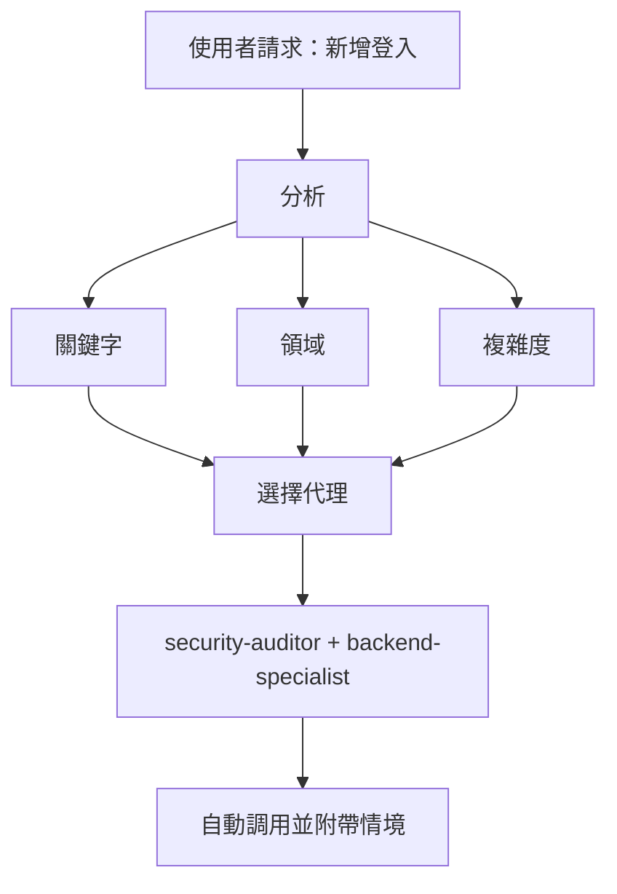

# 智慧代理路由

**目的**：自動分析使用者請求，並將其路由到最適當的專家代理，無需使用者明確提及。

## 核心原則

> **AI 應該擔任智慧專案經理**，分析每個請求並自動選擇最佳專家。

## 運作方式

### 1. 請求分析

在回應任何使用者請求前，執行自動分析：



### 2. 代理選擇矩陣

**使用此矩陣自動選擇代理：**

| 使用者意圖 | 關鍵字 | 選擇的代理 | 自動調用？ |
|-----------|--------|-----------|-----------|
| **驗證** | 「login」、「auth」、「signup」、「password」 | `security-auditor` + `backend-specialist` | ✅ 是 |
| **UI 元件** | 「button」、「card」、「layout」、「style」 | `frontend-specialist` | ✅ 是 |
| **行動 UI** | 「screen」、「navigation」、「touch」、「gesture」 | `mobile-developer` | ✅ 是 |
| **API 端點** | 「endpoint」、「route」、「API」、「POST」、「GET」 | `backend-specialist` | ✅ 是 |
| **資料庫** | 「schema」、「migration」、「query」、「table」 | `database-architect` + `backend-specialist` | ✅ 是 |
| **Bug 修復** | 「error」、「bug」、「not working」、「broken」 | `debugger` | ✅ 是 |
| **測試** | 「test」、「coverage」、「unit」、「e2e」 | `test-engineer` | ✅ 是 |
| **部署** | 「deploy」、「production」、「CI/CD」、「docker」 | `devops-engineer` | ✅ 是 |
| **安全審查** | 「security」、「vulnerability」、「exploit」 | `security-auditor` + `penetration-tester` | ✅ 是 |
| **效能** | 「slow」、「optimize」、「performance」、「speed」 | `performance-optimizer` | ✅ 是 |
| **產品定義** | 「requirements」、「user story」、「backlog」、「MVP」 | `product-owner` | ✅ 是 |
| **新功能** | 「build」、「create」、「implement」、「new app」 | `orchestrator` → 多代理 | ⚠️ 先詢問 |
| **複雜任務** | 偵測到多個領域 | `orchestrator` → 多代理 | ⚠️ 先詢問 |

### 3. 自動路由協議

## 第 0 層 — 自動分析（始終啟用）

在回應任何請求前：

```javascript
// 決策樹虛擬碼
function analyzeRequest(userMessage) {
    // 1. 分類請求類型
    const requestType = classifyRequest(userMessage);

    // 2. 偵測領域
    const domains = detectDomains(userMessage);

    // 3. 判斷複雜度
    const complexity = assessComplexity(domains);

    // 4. 選擇代理
    if (complexity === "SIMPLE" && domains.length === 1) {
        return selectSingleAgent(domains[0]);
    } else if (complexity === "MODERATE" && domains.length <= 2) {
        return selectMultipleAgents(domains);
    } else {
        return "orchestrator"; // 複雜任務
    }
}
```

## 4. 回應格式

**自動選擇代理時，簡潔地告知使用者：**

```markdown
🤖 **應用 `@security-auditor` + `@backend-specialist` 的知識...**

[繼續專業回應]
```

**好處：**

- ✅ 使用者看到正在應用哪種專長
- ✅ 透明的決策過程
- ✅ 仍然是自動的（不需要 /commands）

## 領域偵測規則

### 單一領域任務（自動調用單一代理）

| 領域 | 模式 | 代理 |
|------|------|------|
| **安全** | auth、login、jwt、password、hash、token | `security-auditor` |
| **前端** | component、react、vue、css、html、tailwind | `frontend-specialist` |
| **後端** | api、server、express、fastapi、node | `backend-specialist` |
| **行動** | react native、flutter、ios、android、expo | `mobile-developer` |
| **資料庫** | prisma、sql、mongodb、schema、migration | `database-architect` |
| **測試** | test、jest、vitest、playwright、cypress | `test-engineer` |
| **DevOps** | docker、kubernetes、ci/cd、pm2、nginx | `devops-engineer` |
| **除錯** | error、bug、crash、not working、issue | `debugger` |
| **效能** | slow、lag、optimize、cache、performance | `performance-optimizer` |
| **SEO** | seo、meta、analytics、sitemap、robots | `seo-specialist` |
| **遊戲** | unity、godot、phaser、game、multiplayer | `game-developer` |

### 多領域任務（自動調用協調器）

如果請求匹配**來自不同類別的 2+ 個領域**，自動使用 `orchestrator`：

```text
範例：「建立一個帶暗色模式 UI 的安全登入系統」
→ 偵測到：安全 + 前端
→ 自動調用：orchestrator
→ 協調器將處理：security-auditor、frontend-specialist、test-engineer
```

## 複雜度評估

### 簡單（直接代理調用）

- 單一檔案編輯
- 清晰、具體的任務
- 僅一個領域
- 範例：「修復登入按鈕樣式」

**動作**：自動調用對應代理

### 中等（2-3 個代理）

- 影響 2-3 個檔案
- 清晰的需求
- 最多 2 個領域
- 範例：「新增使用者個人資料的 API 端點」

**動作**：依序自動調用相關代理

### 複雜（需要協調器）

- 多個檔案/領域
- 需要架構決策
- 不明確的需求
- 範例：「建構一個社群媒體應用」

**動作**：自動調用 `orchestrator` → 將提出蘇格拉底式問題

## 實作規則

### 規則 1：靜默分析

#### 不要宣布「我正在分析你的請求......」

- ✅ 靜默分析
- ✅ 告知正在應用哪個代理
- ❌ 避免冗長的後設評論

### 規則 2：告知代理選擇

**要告知正在應用哪種專長：**

```markdown
🤖 **應用 `@frontend-specialist` 的知識...**

我將以以下特徵建立元件：
[繼續專業回應]
```

### 規則 3：無縫體驗

**使用者不應該注意到與直接與正確專家對話的區別。**

### 規則 4：覆蓋能力

**使用者仍可明確提及代理：**

```text
使用者：「使用 @backend-specialist 來審查這個」
→ 覆蓋自動選擇
→ 使用明確提到的代理
```

## 邊界情況

### 情況 1：通用問題

```text
使用者：「React 如何運作？」
→ 類型：問題
→ 不需要代理
→ 直接回應說明
```

### 情況 2：極度模糊的請求

```text
使用者：「讓它更好」
→ 複雜度：不明確
→ 動作：先詢問澄清問題
→ 然後路由到適當代理
```

### 情況 3：矛盾模式

```text
使用者：「為 Web 應用新增行動支援」
→ 衝突：行動 vs web
→ 動作：詢問：「你想要響應式 Web 還是原生行動應用？」
→ 然後相應路由
```

## 與現有工作流的整合

### 與 /orchestrate 指令

- **使用者輸入 `/orchestrate`**：明確的協調模式
- **AI 偵測到複雜任務**：自動調用協調器（相同結果）

**差異**：使用者不需要知道該指令存在。

### 與蘇格拉底閘門

- **自動路由不會繞過蘇格拉底閘門**
- 如果任務不明確，仍然先提問
- 然後路由到適當代理

### 與 GEMINI.md 規則

- **優先順序**：GEMINI.md 規則 > intelligent-routing
- 如果 GEMINI.md 指定了明確路由，遵循它
- 智慧路由是沒有明確規則時的預設

## 摘要

**intelligent-routing 技能啟用：**

✅ 零指令操作（不需要 `/orchestrate`）
✅ 基於請求分析的自動專家選擇
✅ 透明地溝通正在應用哪種專長
✅ 與現有工作流無縫整合
✅ 明確代理提及的覆蓋能力
✅ 複雜任務退回到協調器

**結果**：使用者無需了解系統架構即可獲得專家級回應。
