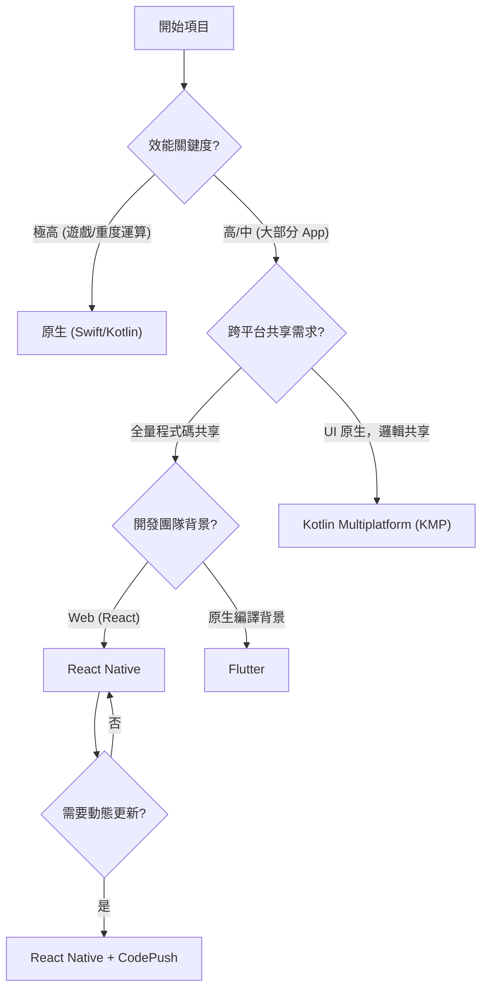
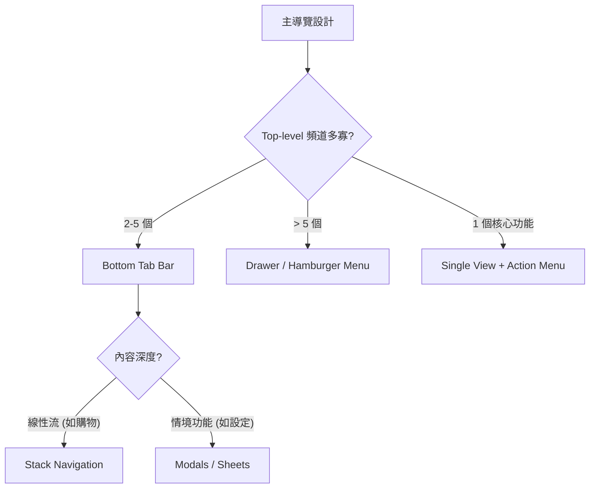
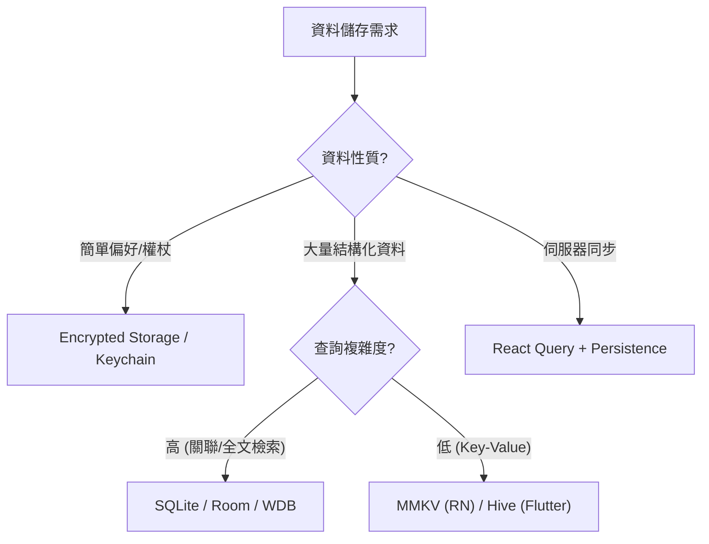
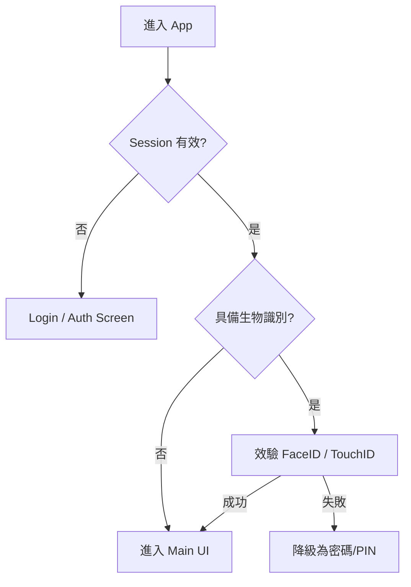

# 行動端決策樹

> **影響力：** 高
> **焦點：** 透過脈絡驅動的選擇來優化架構與開發流程，而非依賴預設模式。

---

## 概述

行動開發涉及一系列複雜的權衡。本節提供決策框架，協助你導航技術棧、狀態管理、導覽模式與離線策略的選擇。

---

## 1. 框架選擇 (Framework Selection)

決定跨平台或原生開發的關鍵標準。

---

## 2. 狀態管理 (State Management)

根據應用場景選擇適合的狀態流。

| 模式 | 適用場景 | 優點 | 缺點 |
| :-- | :-- | :-- | :-- |
| **Zustand / Bloc** | 大多數 App | 輕量、高效、易於測試 | 缺乏原生平台整合 |
| **Redux** | 複雜金融/大型企業 | 嚴格的開發工具與追蹤 | 樣板代碼多 |
| **MobX / Signals** | 資料密集動態更新 | 反應式、寫作負擔低 | 難以追蹤效能瓶頸 |
| **React Query / SWR** | 伺服器狀態為主 | 自動快取、重試與同步 | 不適合複雜本地狀態 |

---

## 3. 導覽模式 (Navigation Patterns)

確保使用者感知的層級與操作流暢度。

---

## 4. 儲存與快取策略 (Storage & Caching)

決定資料持久化的深度。

---

## 5. 離線策略 (Offline Strategy)

定義 App 對網路不穩定環境的容忍度。

1.  **純線上 (Online Only)**:
    *   **場景**: 即時股票交易、串流。
    *   **處理**: 顯示全螢幕 Empty State 與重試按鈕。
2.  **優先從快取讀取 (Cache First)**:
    *   **場景**: 社群媒體、內容閱讀。
    *   **處理**: 顯示過期資料並標示「正在同步」。
3.  **完全離線支援 (Offline First)**:
    *   **場景**: 記事本、清單工具。
    *   **處理**: 本地資料庫為真 (Single Source of Truth)，非同步同步至後端。

---

## 6. 身分驗證流程 (Authentication Flow)

---

## 7. 項目模板與啟動腳本 (Project Templates)

### React Native
*   **Expo (推薦)**: 大多數現代 App 的首選，具備完善的環境與更新機制 (EAS)。
*   **Bare Workflow**: 需要自定義原生模組或底層優化時使用。

### Flutter
*   **Classic Architecture**: 使用 Provider + GoRouter。
*   **Clean Architecture**: 適合需要嚴格測試的大型項目。

---

## 8. 最後檢查清單 (Decision Checklist)

在開始編寫程式碼前，請確認以下問題：

1. [ ] **環境檢測**: 是否處理了飛航模式或地下室網路？
2. [ ] **平台差異**: iOS 的「滑動返回」與 Android 的「硬體返回鍵」是否皆有處理？
3. [ ] **輸入法**: 軟體鍵盤是否會遮擋輸入框？
4. [ ] **效能預期**: 低端設備上的清單捲動是否流暢？
5. [ ] **資安**: 機敏資料是否存放在 Secure Storage 而非 AsyncStorage？

---

> [!IMPORTANT]
> **決策原則**：行動端環境變化極大（螢幕尺寸、網路、電量）。選擇方案時，應優先考慮「容錯率」與「恢復速度」而非單純的開發便利性。
