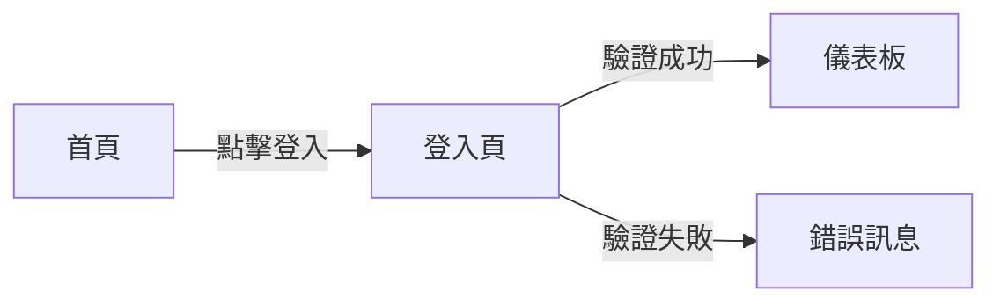

# [產品/功能名稱] PRD

| 屬性 | 內容 |
| :--- | :--- |
| **版本** | v1.0 |
| **狀態** | 草稿 / 審核中 / 已核准 / 已凍結 |
| **作者** | [姓名] |
| **審核者** | [姓名] |
| **建立日期** | YYYY-MM-DD |
| **最後更新** | YYYY-MM-DD |

## 1. 簡介
### 1.1 問題陳述
描述使用者目前面臨的痛點或市場機會。

### 1.2 目標與目的
*   目標 1：例如，提升使用者留存率 10%。
*   目標 2：例如，將操作步驟從 5 步減少到 2 步。

### 1.3 成功指標 (KPIs)
如何衡量成功？（例如：DAU、轉換率、載入時間）

## 2. 使用者故事
| ID | 作為 (角色) | 我想要 (動作) | 以便於 (效益) | 優先級 |
| :--- | :--- | :--- | :--- | :--- |
| US-01 | 一般使用者 | 點擊一鍵備份按鈕 | 將所有書籤儲存到雲端 | 高 |
| US-02 | 管理員 | 查看每週備份統計 | 了解系統負載 | 中 |

## 3. 功能需求
### 3.1 功能 A
功能 A 行為的詳細描述。
*   **FR-01**：系統須...
*   **FR-02**：當使用者...

### 3.2 功能 B
...

## 4. 驗收條件
> **[關鍵]** 每個功能需求都必須有對應的驗收條件，使用 Given-When-Then 格式。

### FR-01 驗收條件
```gherkin
Given 使用者已登入系統
When 使用者點擊「備份」按鈕
Then 系統須在 3 秒內完成備份
And 顯示「備份成功」通知
```

### FR-02 驗收條件
```gherkin
Given [前置條件]
When [使用者動作]
Then [預期結果]
And [額外驗證點]
```

## 5. 使用者體驗 (UI/UX)
描述介面流程或附上設計稿連結。



## 6. 非功能需求
*   **安全性**：例如，密碼必須加密儲存。
*   **效能**：例如，API 回應時間 < 200ms。
*   **相容性**：例如，支援 iOS 15+、Android 10+。

## 7. 數據分析與追蹤
*   追蹤事件：`button_click` {source: "home"}
*   追蹤事件：`api_error` {code: 500}

## 8. 範圍外項目
*   不支援 IE 瀏覽器。

---

## 修訂歷史

| 版本 | 日期 | 作者 | 變更內容 |
|------|------|------|----------|
| v1.0 | YYYY-MM-DD | [姓名] | 初稿 |
