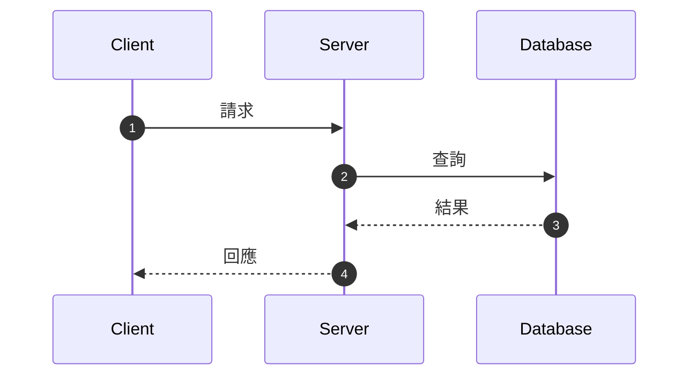
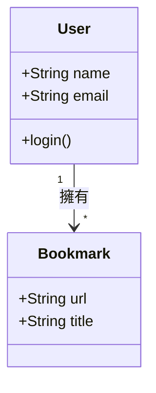
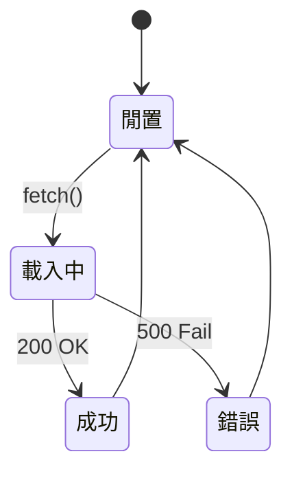
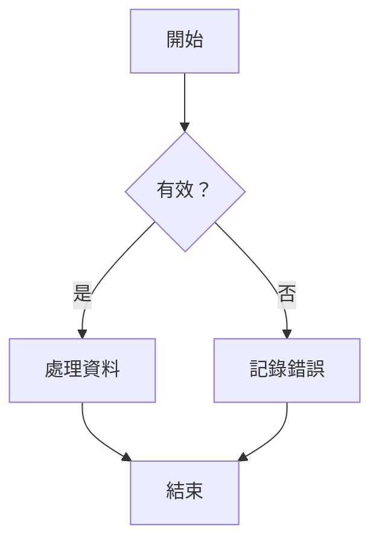

# 系統分析 Mermaid 圖表指南

## 1. 時序圖
用於展示物件之間的互動順序，適用於 API 呼叫流程或訊息傳遞。

```mermaid
sequenceDiagram
    autonumber
    Client->>Server: 請求
    Server->>Database: 查詢
    Database-->>Server: 結果
    Server-->>Client: 回應
```

## 2. 類別圖
用於展示資料結構或類別關係。

```mermaid
classDiagram
    class User {
        +String name
        +String email
        +login()
    }
    class Bookmark {
        +String url
        +String title
    }
    User "1" --> "*" Bookmark : 擁有
```

## 3. 狀態圖
用於展示物件生命週期中的狀態變化。

```mermaid
stateDiagram-v2
    [*] --> 閒置
    閒置 --> 載入中 : fetch()
    載入中 --> 成功 : 200 OK
    載入中 --> 錯誤 : 500 Fail
    成功 --> 閒置
    錯誤 --> 閒置
```

## 4. 流程圖
用於展示演算法或業務邏輯決策。

```mermaid
graph TD
    Start[開始] --> IsValid{有效？}
    IsValid -->|是| Process[處理資料]
    IsValid -->|否| Log[記錄錯誤]
    Process --> End[結束]
    Log --> End
```
