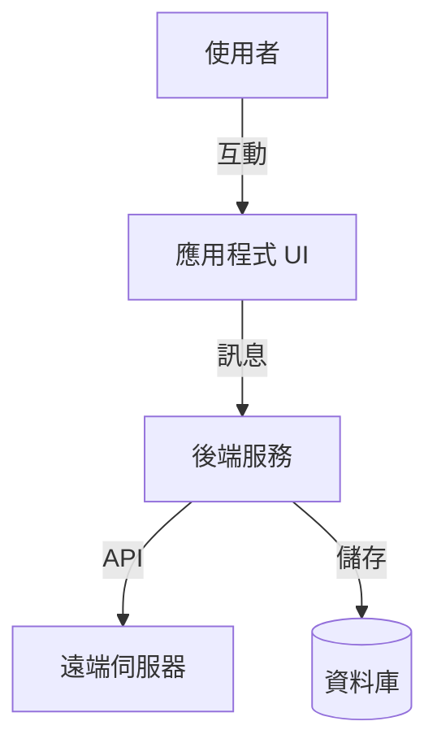
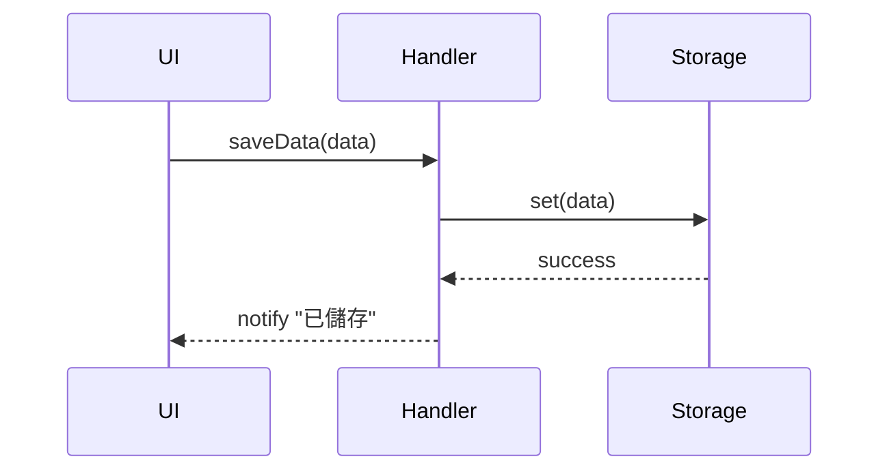

# [系統名稱/功能] 系統設計文件

| 屬性 | 內容 |
| :--- | :--- |
| **版本** | v1.0 |
| **狀態** | 草稿 / 審核中 / 已核准 / 已凍結 |
| **作者** | [姓名] |
| **關聯 PRD** | [PRD_spec.md 連結] |
| **PRD 版本** | v1.0 |
| **建立日期** | YYYY-MM-DD |
| **最後更新** | YYYY-MM-DD |

## 1. 概述
### 1.1 範圍
本文件涵蓋的技術範圍，以及不包含的內容。

### 1.2 架構圖
高層級架構圖（Context Diagram 或 Container Diagram）。



## 2. 需求追溯
> **[關鍵]** 此表格建立 PRD 需求與 SA 設計之間的追溯關係，確保每個需求都有對應的技術實作。

| 需求 ID | PRD 章節 | SA 章節 | 實作檔案 | 測試檔案 |
|---------|----------|---------|----------|----------|
| FR-01   | PRD 3.1  | SA 2.1  | `module/handler.js` | `handler.test.js` |
| FR-02   | PRD 3.1  | SA 2.2  | `module/api.js`     | `api.test.js` |
| FR-03   | PRD 3.2  | SA 2.3  | `module/ui.js`      | - |

## 3. 元件設計
### 3.1 [模組 A]
*   **描述**：功能描述。
*   **職責**：職責清單。
*   **相依性**：依賴的其他模組。
*   **介面**：公開的方法 (Public Methods)。

### 3.2 [模組 B]
...

## 4. 資料設計
### 4.1 資料模型 (Schema)
定義核心資料結構。

```json
// UserSettings
{
  "theme": "dark",
  "notifications": true,
  "lastSync": 1678900000
}
```

### 4.2 儲存策略
*   **持久儲存**：資料庫或本地儲存（使用者資料）
*   **工作階段儲存**：記憶體或 Session 儲存（暫時狀態）

## 5. 介面設計 (API)
### 5.1 內部 API
定義內部通訊協議。

*   **請求**：`GET_USER_DATA`
    *   酬載：`{ userId: string }`
*   **回應**：
    *   成功：`{ user: UserProfile }`
    *   錯誤：`{ error: string }`

## 6. 時序流程
關鍵業務流程的時序圖。



## 7. 測試策略
### 7.1 測試影響分析
> 列出此變更影響的現有測試，以及需要新增的測試。

| 測試檔案 | 影響 | 需要的動作 |
|----------|------|------------|
| `existing.test.js` | 匯入路徑變更 | 更新匯入 |
| `new.test.js` | 新測試 | 建立測試 |

### 7.2 驗證計畫
*   **單元測試**：驗證單一模組功能
*   **整合測試**：驗證模組間互動
*   **手動驗證**：手動驗證步驟

## 8. 安全與效能
*   **安全性**：輸入驗證 (Sanitization)、權限檢查。
*   **效能**：大量資料分頁處理、快取策略。

---

## 修訂歷史

| 版本 | 日期 | 作者 | 變更內容 |
|------|------|------|----------|
| v1.0 | YYYY-MM-DD | [姓名] | 初稿 |
