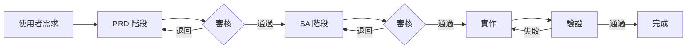

# 規格驅動開發 (SDD) 技能

此技能整合 **PRD（需求）** 和 **SA（分析）** 知識，定義標準開發工作流程。核心原則是 **「沒有規格，就沒有程式碼」**。

## 核心原則

1.  **規格優先**：規格在程式碼之前
2.  **可追溯性**：每個需求都可以追溯到設計和實作
3.  **驗收驅動**：每個需求都有可驗證的驗收條件
4.  **版本控制**：規格文件受版本控制，有變更流程
5.  **活文件**：程式碼變更必須同步更新規格以保持一致性

## 工作流程概覽



## 設定

> ⚠️ **必要設定**：使用此技能前，請根據你的專案結構自訂規格目錄路徑。

預設情況下，此技能參考 `/docs/specs/` 作為文件位置。請更新以下檔案中的路徑：
- 此檔案 (`sdd/SKILL.md`)
- `sdd/references/tasks.md`

### 建議的目錄結構

```
your-project/
├── docs/
│   └── specs/              ← 自訂此路徑
│       ├── feature/
│       │   └── ISSUE-101_feature-name/
│       │       ├── PRD_spec.md
│       │       └── SA_spec.md
│       └── fix/
│           └── ISSUE-102_bug-name/
│               ├── PRD_spec.md
│               └── SA_spec.md
```

## 核心工作流程

此工作流程使用三階段開發模型。所有產出物儲存在可設定的規格目錄中。

### 階段 1：產品需求 (PRD)
*   **目標**：定義「做什麼」和「為什麼」。
*   **檔案位置**：`{SPECS_DIR}/{type}/{ID-PREFIX}_{desc}/PRD_spec.md`
*   **參考技能**：`prd`（參見 `../prd/SKILL.md`）
*   **快速指南**：`sdd/references/requirements.md`
*   **關鍵內容**：
    *   使用者故事 (US-XX)
    *   功能需求 (FR-XX, EARS 語法)
    *   **驗收條件**（Given-When-Then）⭐ 必要
    *   成功指標 / 範圍外項目
*   **版本控制**：使用 Version 欄位（例如 v1.0）

### 階段 2：系統分析 (SA)
*   **目標**：定義「怎麼做」。將業務需求轉化為技術規格。
*   **檔案位置**：`{SPECS_DIR}/{type}/{ID-PREFIX}_{desc}/SA_spec.md`
*   **參考技能**：`sa`（參見 `../sa/SKILL.md`）
*   **快速指南**：`sdd/references/design.md`
*   **關鍵內容**：
    *   **需求追溯矩陣** ⭐ 必要
    *   系統架構（Mermaid）
    *   API 規格 / 資料模型
    *   **測試影響分析** ⭐ 必要
*   **版本控制**：註明對應的 PRD 版本

### 階段 3：實作
*   **目標**：執行 SA 階段定義的任務。
*   **參考指南**：`sdd/references/tasks.md`
*   **前置條件**：PRD 和 SA 都必須處於**已核准/已凍結**狀態
*   **動作**：
    *   依據 `SA_spec.md` 編寫程式碼
    *   **同步**：如果實作過程發現需要調整設計，**必須**先更新 SA/PRD
    *   依據 `PRD_spec.md` 的驗收條件進行驗證

## 命名規範

目錄名稱格式：`{ID_PREFIX}_{short-description}`

`ID_PREFIX` 有三種類型：

1.  **ISSUE（標準）**：對應 GitHub Issue ID。
    *   範例：`ISSUE-123_tab-groups`
    *   用途：一般功能開發和錯誤修復。
2.  **PR（外部）**：對應 Pull Request ID（如果沒有 Issue）。
    *   範例：`PR-456_typo-fix`
    *   用途：外部貢獻者直接提交的 PR。
3.  **BASE（基線/歷史）**：專案初始化或追溯性規格。
    *   範例：`BASE-001_initial-architecture`
    *   用途：沒有對應 Issue 的歷史技術債或基礎架構文件。

## 目錄結構範例

```text
{SPECS_DIR}/
  ├── feature/
  │    └── ISSUE-101_tab-groups/   <-- 標準流程
  │         ├── PRD_spec.md
  │         └── SA_spec.md
  └── fix/
       └── BASE-002_sync-bug/      <-- 歷史/基線
            ├── PRD_spec.md
            └── SA_spec.md
```

## 代理操作指南

當收到使用者任務時：

1.  **檢查需求**：判斷任務是否需要完整的 SDD 流程。
2.  **建立目錄**：使用 `mkdir -p` 建立正確的資料夾路徑。
3.  **起草 PRD**：撰寫 `PRD_spec.md`，**必須包含驗收條件**。
4.  **審核關卡**：請求使用者審核，等待核准。
5.  **起草 SA**：撰寫 `SA_spec.md`，**必須包含需求追溯**。
6.  **審核關卡**：請求使用者審核，等待核准。
7.  **編寫程式碼**：核准後，開始實作。
8.  **驗證**：依據驗收條件進行驗證。

## 規格變更流程

規格進入**已凍結**狀態後，任何變更需要：

1.  建立新版本（例如 v1.0 → v1.1）
2.  在修訂歷史中記錄變更原因
3.  重新取得審核者核准
4.  更新相關追溯矩陣

## 技能內容

```
sdd/
├── SKILL.md                           # 此檔案 - 協調工作流程
└── references/
    ├── requirements.md                # 需求快速指南
    ├── design.md                      # 設計快速指南
    └── tasks.md                       # 實作任務模板
```

## 參考資源

| 階段 | 快速指南 | 完整模板 |
|------|----------|----------|
| **PRD** | `sdd/references/requirements.md` | `prd/references/template_comprehensive.md` |
| **SA** | `sdd/references/design.md` | `sa/references/system_design_doc.md` |
| **任務** | `sdd/references/tasks.md` | - |
