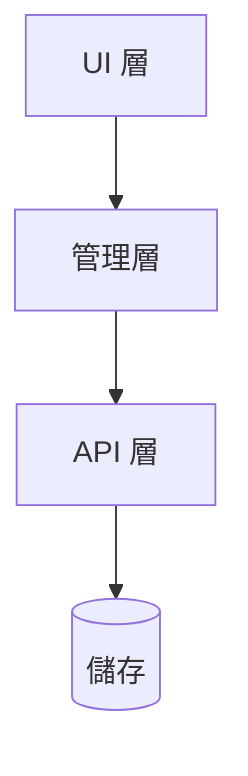
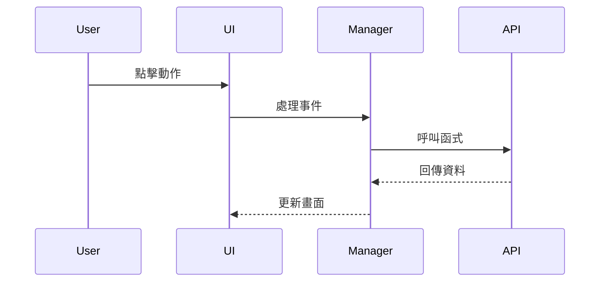

# SDD 階段 2：設計 (SA)

> 本文件是 SDD 階段 2 的快速參考指南。詳細內容請參閱 **SA 技能**。

## 📚 完整資源

- **技能文件**：[`../sa/SKILL.md`](../sa/SKILL.md)
- **完整模板**：[`../sa/references/system_design_doc.md`](../sa/references/system_design_doc.md)
- **圖表指南**：[`../sa/references/diagram_guide.md`](../sa/references/diagram_guide.md)

---

## 快速檢查清單

撰寫 `SA_spec.md` 時，確保包含這些核心章節：

- [ ] **標頭**：版本、狀態、關聯 PRD（含版本）
- [ ] **需求追溯**：每個 FR 必須對應到 SA 章節
- [ ] **架構圖**：高層級架構圖（Mermaid）
- [ ] **元件設計**：模組職責和介面定義
- [ ] **資料設計**：綱要變更和儲存策略
- [ ] **時序流程**：關鍵流程的時序圖
- [ ] **測試策略**：測試影響分析

---

## 需求追溯範例

| 需求 ID | PRD 章節 | SA 章節 | 實作檔案 | 測試檔案 |
|---------|----------|---------|----------|----------|
| FR-01   | PRD 3.1  | SA 3.1  | `tabRenderer.js`      | `tab.test.js` |
| FR-02   | PRD 3.2  | SA 3.2  | `bookmarkRenderer.js` | `bookmark.test.js` |

---

## 常用 Mermaid 圖表

### 架構圖

### 時序圖

---

## 測試影響分析範例

| 測試檔案 | 影響 | 需要的動作 |
|----------|------|------------|
| `perf_benchmark.test.js` | 匯入路徑變更 | 更新匯入 |
| `integration.test.js` | DOM 結構相依性 | 確保 CSS 選擇器維持不變 |

---

## 版本控制

- SA 必須註明對應的 PRD 版本（例如 `PRD 版本：v1.0`）
- SA 進入**已凍結**狀態後，遵循變更請求流程
