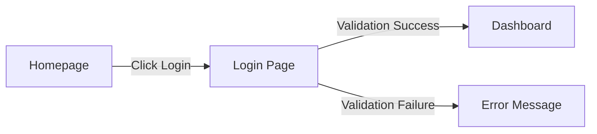

# [Product/Feature Name] PRD

| Attribute | Details |
| :--- | :--- |
| **Version** | v1.0 |
| **Status** | Draft / Review / Approved / Frozen |
| **Author** | [Name] |
| **Reviewers** | [Names] |
| **Created** | YYYY-MM-DD |
| **Last Updated** | YYYY-MM-DD |

## 1. Introduction
### 1.1 Problem Statement
Describe the pain points users currently face or market opportunities.

### 1.2 Goals & Objectives
*   Goal 1: e.g., Improve user retention by 10%.
*   Goal 2: e.g., Reduce operation steps from 5 to 2.

### 1.3 Success Metrics (KPIs)
How will success be measured? (e.g., DAU, conversion rate, load time)

## 2. User Stories
| ID | As a (Role) | I want to (Action) | So that (Benefit) | Priority |
| :--- | :--- | :--- | :--- | :--- |
| US-01 | General user | Click a one-click backup button | Save all bookmarks to the cloud | High |
| US-02 | Admin | View weekly backup statistics | Understand system load | Medium |

## 3. Functional Requirements
### 3.1 Feature A
Detailed description of Feature A behavior.
*   **FR-01**: The system shall...
*   **FR-02**: When the user...

### 3.2 Feature B
...

## 4. Acceptance Criteria
> **[Critical]** Each Functional Requirement must have corresponding Acceptance Criteria in Given-When-Then format.

### AC for FR-01
```gherkin
Given the user is logged into the system
When the user clicks the "Backup" button
Then the system shall complete backup within 3 seconds
And display a "Backup Successful" notification
```

### AC for FR-02
```gherkin
Given [precondition]
When [user action]
Then [expected result]
And [additional verification point]
```

## 5. User Experience (UI/UX)
Describe interface flow or attach design links.



## 6. Non-Functional Requirements
*   **Security**: e.g., Passwords must be encrypted.
*   **Performance**: e.g., API response < 200ms.
*   **Compatibility**: e.g., Support iOS 15+, Android 10+.

## 7. Analytics & Tracking
*   Track Event: `button_click` {source: "home"}
*   Track Event: `api_error` {code: 500}

## 8. Out of Scope
*   No IE browser support.

---

## Revision History

| Version | Date | Author | Changes |
|---------|------|--------|---------|
| v1.0 | YYYY-MM-DD | [Name] | Initial draft |
