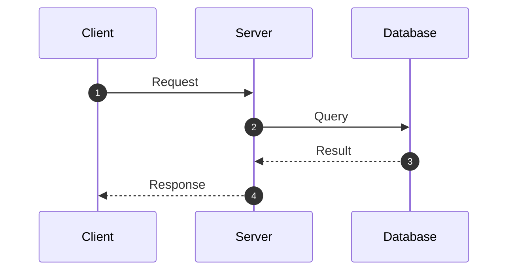
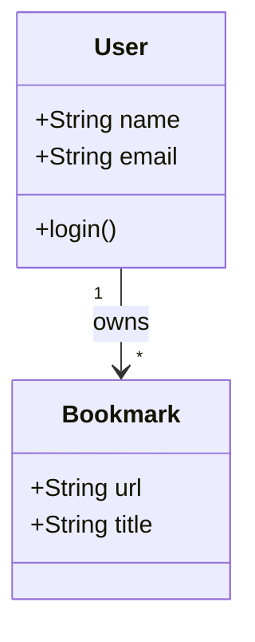
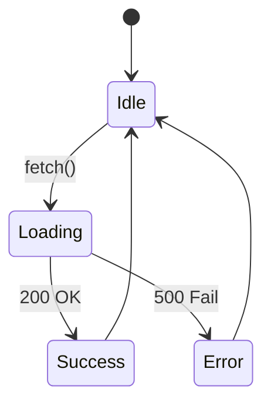
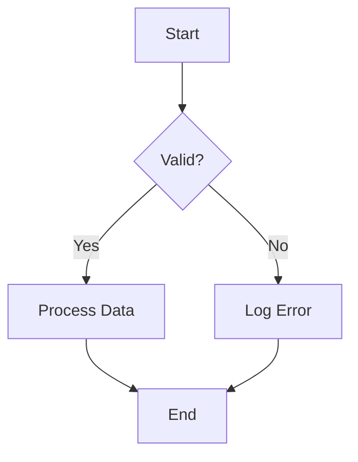

# Mermaid Diagram Guide for System Analysis

## 1. Sequence Diagram
Used to show the interaction sequence between objects, suitable for API call flows or message passing.

## 2. Class Diagram
Used to show data structures or class relationships.

## 3. State Diagram
Used to show state changes in an object's lifecycle.

## 4. Flowchart
Used to show algorithms or business logic decisions.

