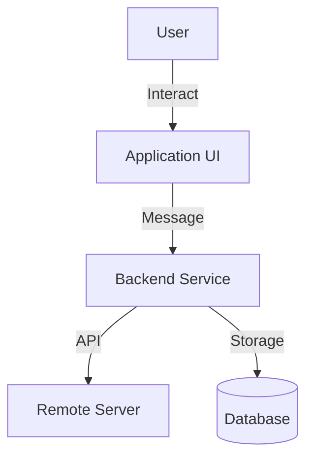
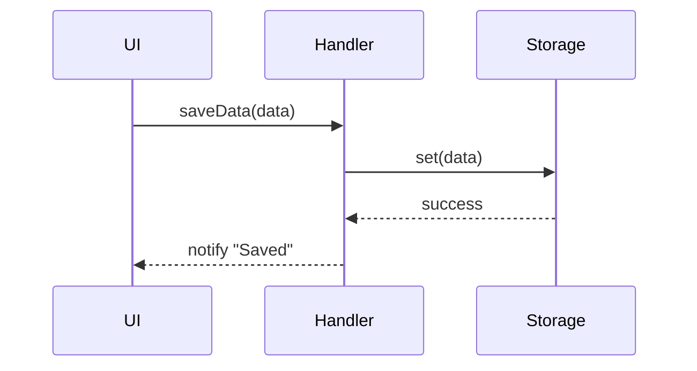

# [System Name/Feature] System Design Document

| Attribute | Details |
| :--- | :--- |
| **Version** | v1.0 |
| **Status** | Draft / Review / Approved / Frozen |
| **Author** | [Name] |
| **Related PRD** | [Link to PRD_spec.md] |
| **PRD Version** | v1.0 |
| **Created** | YYYY-MM-DD |
| **Last Updated** | YYYY-MM-DD |

## 1. Overview
### 1.1 Scope
The technical scope covered by this document, and what is not included.

### 1.2 Architecture Diagram
High-level architecture diagram (Context Diagram or Container Diagram).



## 2. Requirement Traceability
> **[Critical]** This table establishes traceability between PRD requirements and SA design, ensuring every requirement has a corresponding technical implementation.

| Req ID | PRD Section | SA Section | Implementation File | Test File |
|--------|-------------|------------|---------------------|-----------|
| FR-01  | PRD 3.1     | SA 2.1     | `module/handler.js` | `handler.test.js` |
| FR-02  | PRD 3.1     | SA 2.2     | `module/api.js`     | `api.test.js` |
| FR-03  | PRD 3.2     | SA 2.3     | `module/ui.js`      | - |

## 3. Component Design
### 3.1 [Module A]
*   **Description**: Functional description.
*   **Responsibilities**: List of responsibilities.
*   **Dependencies**: Other modules it depends on.
*   **Interfaces**: Exposed Public Methods.

### 3.2 [Module B]
...

## 4. Data Design
### 4.1 Data Models (Schema)
Define core data structures.

```json
// UserSettings
{
  "theme": "dark",
  "notifications": true,
  "lastSync": 1678900000
}
```

### 4.2 Storage Strategy
*   **Persistent**: Database or local storage (User data)
*   **Session**: In-memory or session storage (Temporary state)

## 5. Interface Design (API)
### 5.1 Internal API
Define internal communication protocols.

*   **Request**: `GET_USER_DATA`
    *   Payload: `{ userId: string }`
*   **Response**:
    *   Success: `{ user: UserProfile }`
    *   Error: `{ error: string }`

## 6. Sequence Flows
Sequence diagrams for key business processes.



## 7. Testing Strategy
### 7.1 Test Impact Analysis
> List existing tests affected by this change, and new tests that need to be added.

| Test File | Impact | Action Required |
|-----------|--------|-----------------|
| `existing.test.js` | Import path change | Update imports |
| `new.test.js` | New test | Create test |

### 7.2 Verification Plan
*   **Unit Tests**: Verify individual module functionality
*   **Integration Tests**: Verify inter-module interactions
*   **Manual Verification**: Manual verification steps

## 8. Security & Performance
*   **Security**: Input validation (Sanitization), permission checks.
*   **Performance**: Pagination for large datasets, caching strategies.

---

## Revision History

| Version | Date | Author | Changes |
|---------|------|--------|---------|
| v1.0 | YYYY-MM-DD | [Name] | Initial draft |
