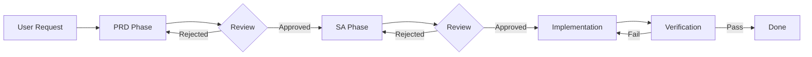

# Spec-Driven Development (SDD) Skill

This skill integrates **PRD (Requirements)** and **SA (Analysis)** knowledge, defining a standard development workflow. The core principle is **"No Spec, No Code"**.

## Core Principles

1.  **Spec-First**: Specs come before code
2.  **Traceability**: Every requirement can be traced to design and implementation
3.  **Acceptance-Driven**: Every requirement has verifiable acceptance criteria
4.  **Version Control**: Spec documents are version-controlled with change processes
5.  **Living Documentation**: Code changes must sync with spec updates to maintain consistency

## Workflow Overview



## Configuration

> ⚠️ **Required**: Before using this skill, customize the spec directory path to match your project structure.

By default, this skill references `/docs/specs/` as the documentation location. Update paths in:
- This file (`sdd/SKILL.md`)
- `sdd/references/tasks.md`

### Recommended Directory Structure

```
your-project/
├── docs/
│   └── specs/              ← Customize this path
│       ├── feature/
│       │   └── ISSUE-101_feature-name/
│       │       ├── PRD_spec.md
│       │       └── SA_spec.md
│       └── fix/
│           └── ISSUE-102_bug-name/
│               ├── PRD_spec.md
│               └── SA_spec.md
```

## Core Workflow

This workflow uses a three-phase development model. All artifacts are stored in a configurable specs directory.

### Phase 1: Product Requirement (PRD)
*   **Goal**: Define "What" and "Why".
*   **File Location**: `{SPECS_DIR}/{type}/{ID-PREFIX}_{desc}/PRD_spec.md`
*   **Reference Skill**: `prd` (See `../prd/SKILL.md`)
*   **Quick Guide**: `sdd/references/requirements.md`
*   **Key Content**:
    *   User Stories (US-XX)
    *   Functional Requirements (FR-XX, EARS syntax)
    *   **Acceptance Criteria** (Given-When-Then) ⭐ Required
    *   Success Metrics / Out of Scope
*   **Version Control**: Use Version field (e.g., v1.0)

### Phase 2: System Analysis (SA)
*   **Goal**: Define "How". Transform business requirements into technical specs.
*   **File Location**: `{SPECS_DIR}/{type}/{ID-PREFIX}_{desc}/SA_spec.md`
*   **Reference Skill**: `sa` (See `../sa/SKILL.md`)
*   **Quick Guide**: `sdd/references/design.md`
*   **Key Content**:
    *   **Requirement Traceability Matrix** ⭐ Required
    *   System Architecture (Mermaid)
    *   API Specifications / Data Models
    *   **Test Impact Analysis** ⭐ Required
*   **Version Control**: Note the corresponding PRD version

### Phase 3: Implementation
*   **Goal**: Execute tasks defined in the SA phase.
*   **Reference Guide**: `sdd/references/tasks.md`
*   **Prerequisites**: Both PRD and SA must be in **Approved/Frozen** status
*   **Actions**:
    *   Code based on `SA_spec.md`
    *   **Sync**: If implementation reveals design adjustments needed, **must** update SA/PRD first
    *   Verify against Acceptance Criteria from `PRD_spec.md`

## Naming Convention

Directory name format: `{ID_PREFIX}_{short-description}`

`ID_PREFIX` has three types:

1.  **ISSUE (Standard)**: Corresponds to GitHub Issue ID.
    *   Example: `ISSUE-123_tab-groups`
    *   Use: General feature development and bug fixes.
2.  **PR (External)**: Corresponds to Pull Request ID (if no Issue exists).
    *   Example: `PR-456_typo-fix`
    *   Use: PRs submitted directly by external contributors.
3.  **BASE (Baseline/Historical)**: Project initialization or retrospective specs.
    *   Example: `BASE-001_initial-architecture`
    *   Use: Historical debt or foundational architecture documents without corresponding Issues.

## Directory Structure Example

```text
{SPECS_DIR}/
  ├── feature/
  │    └── ISSUE-101_tab-groups/   <-- Standard Flow
  │         ├── PRD_spec.md
  │         └── SA_spec.md
  └── fix/
       └── BASE-002_sync-bug/      <-- Legacy/Baseline
            ├── PRD_spec.md
            └── SA_spec.md
```

## Agent Operation Guide

When receiving a user task:

1.  **Check Requirements**: Determine if the task warrants full SDD process.
2.  **Scaffold**: Use `mkdir -p` to create the correct folder path.
3.  **Draft PRD**: Write `PRD_spec.md`, **must include Acceptance Criteria**.
4.  **Review Gate**: Request User Review, wait for approval.
5.  **Draft SA**: Write `SA_spec.md`, **must include Requirement Traceability**.
6.  **Review Gate**: Request User Review, wait for approval.
7.  **Code**: After approval, begin implementation.
8.  **Verify**: Verify against Acceptance Criteria.

## Spec Change Process

After a Spec enters **Frozen** status, any changes require:

1.  Create new version (e.g., v1.0 → v1.1)
2.  Record change reason in Revision History
3.  Re-obtain Reviewer approval
4.  Update related Traceability Matrix

## Skill Contents

```
sdd/
├── SKILL.md                           # This file - Orchestration workflow
└── references/
    ├── requirements.md                # Quick PRD reference
    ├── design.md                      # Quick SA reference
    └── tasks.md                       # Implementation task template
```

## References

| Phase | Quick Guide | Full Template |
|-------|-------------|---------------|
| **PRD** | `sdd/references/requirements.md` | `prd/references/template_comprehensive.md` |
| **SA** | `sdd/references/design.md` | `sa/references/system_design_doc.md` |
| **Tasks** | `sdd/references/tasks.md` | - |
