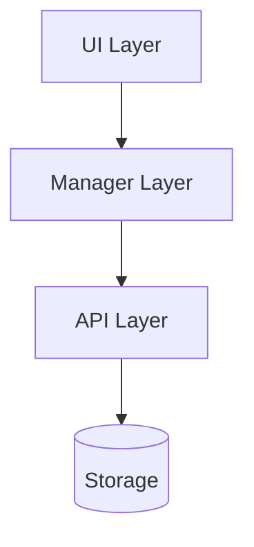
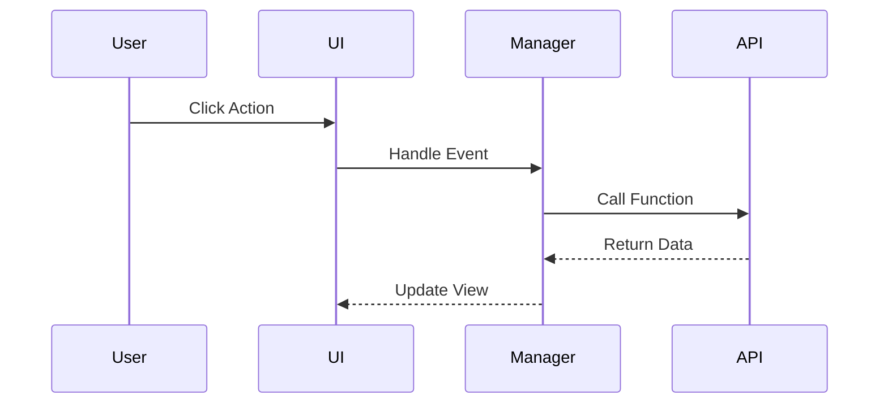

# SDD Phase 2: Design (SA)

> This document is a quick reference guide for SDD Phase 2. For detailed content, see the **SA Skill**.

## 📚 Full Resources

- **Skill Documentation**: [`../sa/SKILL.md`](../sa/SKILL.md)
- **Full Template**: [`../sa/references/system_design_doc.md`](../sa/references/system_design_doc.md)
- **Diagram Guide**: [`../sa/references/diagram_guide.md`](../sa/references/diagram_guide.md)

---

## Quick Checklist

When writing `SA_spec.md`, ensure you include these core sections:

- [ ] **Header**: Version, Status, Related PRD (with version)
- [ ] **Requirement Traceability**: Each FR must map to an SA Section
- [ ] **Architecture Diagram**: High-level architecture diagram (Mermaid)
- [ ] **Component Design**: Module responsibilities and interface definitions
- [ ] **Data Design**: Schema changes and storage strategies
- [ ] **Sequence Flows**: Sequence diagrams for key processes
- [ ] **Testing Strategy**: Test Impact Analysis

---

## Requirement Traceability Example

| Req ID | PRD Section | SA Section | Implementation File | Test File |
|--------|-------------|------------|---------------------|-----------|
| FR-01  | PRD 3.1     | SA 3.1     | `tabRenderer.js`    | `tab.test.js` |
| FR-02  | PRD 3.2     | SA 3.2     | `bookmarkRenderer.js` | `bookmark.test.js` |

---

## Common Mermaid Diagrams

### Architecture Diagram

### Sequence Diagram

---

## Test Impact Analysis Example

| Test File | Impact | Action Required |
|-----------|--------|-----------------|
| `perf_benchmark.test.js` | Import path change | Update imports |
| `integration.test.js` | DOM structure dependency | Ensure CSS selectors remain unchanged |

---

## Version Control

- SA must note the corresponding PRD version (e.g., `PRD Version: v1.0`)
- After SA enters **Frozen** status, follow the Change Request process
